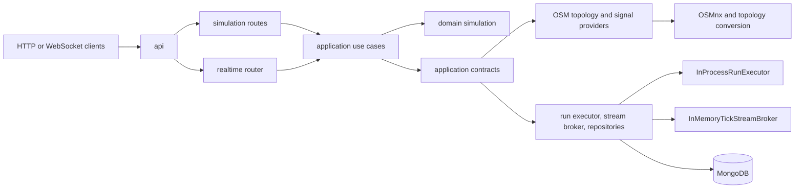
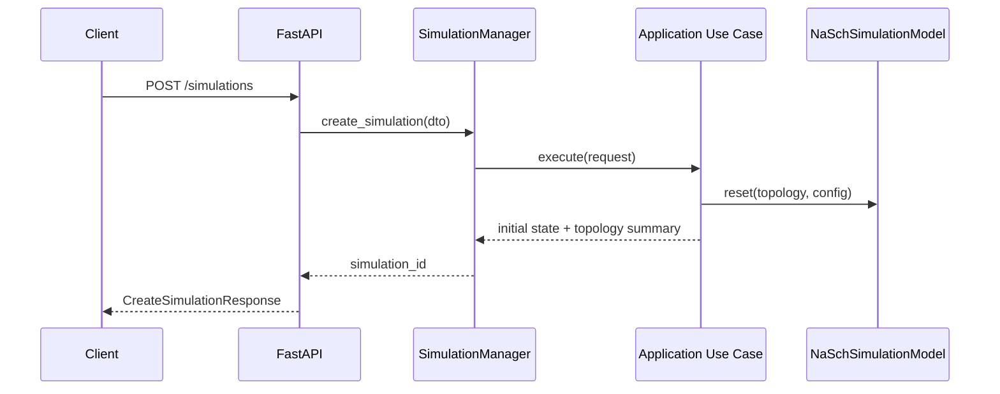
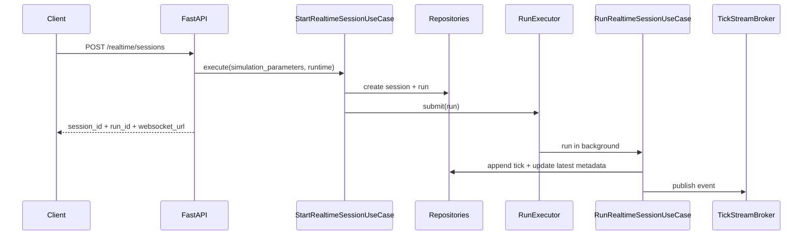

# Traffic Engine Architecture

Last updated: 2026-04-26

This file is the architecture source of truth for the repository.

## 1. Repository Scope

| Surface | Status | Notes |
| --- | --- | --- |
| Core simulation engine | Active | Domain NaSch model, multilane rules, topology, and signal behavior |
| FastAPI synchronous API | Active | Create, step, metrics, snapshot, list, and delete simulation endpoints |
| FastAPI realtime API | Active | Persisted sessions, runs, tick history, WebSocket replay/follow, and SSE compatibility |
| Bundled frontend runtime | Removed from repo scope | External consumers use the documented HTTP and WebSocket contracts |

## 2. Architectural Style

Traffic Engine uses layered hexagonal architecture.

1. Domain owns simulation behavior and business invariants.
2. Application owns use-case orchestration and interface contracts.
3. Infrastructure owns adapters for persistence, runtime execution, topology ingestion, and streaming.
4. API owns HTTP/WebSocket transport, validation, and dependency wiring.

## 3. Layer Rules

Dependency rules are mandatory.

1. Domain must not import from application, infrastructure, or api modules.
2. Application may import domain and application contracts only.
3. Infrastructure may import application contracts and domain models for mapping.
4. API may import application contracts/use cases and infrastructure composition modules.
5. Raw environment variable access for MongoDB belongs only to infrastructure persistence modules.

## 4. Component Map

## 5. Primary Runtime Flows

### 5.1 Synchronous Simulation Flow

### 5.2 Persisted Realtime Flow

## 6. Persistence Model

| Collection / contract | Responsibility | Key rule |
| --- | --- | --- |
| `simulation_sessions` / `SimulationSessionRepository` | Session metadata and latest bounded state | No unbounded tick arrays in session documents |
| `simulation_runs` / `SimulationRunRepository` | Execution attempts linked to one session | Only one active run per session at a time |
| `simulation_ticks` / `SimulationTickRepository` | Immutable per-tick history | Unique identity is `run_id + tick_number` |

Persistence guardrails:

1. Persist before publish for every tick.
2. Replay reads are ordered strictly by `tick_number` ascending.
3. Extension creates a new run and does not recreate the session document.

## 7. Public Transport Contracts

| Capability | Contract |
| --- | --- |
| Synchronous control | `POST /simulations`, `POST /simulations/{simulation_id}/step`, `GET /simulations/{simulation_id}/metrics`, `GET /simulations/{simulation_id}/snapshot`, `DELETE /simulations/{simulation_id}` |
| Realtime creation | `POST /realtime/sessions` |
| Realtime extension | `POST /realtime/sessions/{session_id}/runs` |
| History browsing | `GET /realtime/sessions`, `GET /realtime/sessions/{session_id}/runs`, `GET /realtime/sessions/{session_id}/ticks` |
| Canonical live transport | `GET /realtime/sessions/{session_id}/ws` with `run_id`, `from_tick`, and `follow` |
| Compatibility transport | `GET /realtime/sessions/{session_id}/stream` |

Transport rules:

1. WebSocket is the canonical replay-plus-follow contract.
2. Recovery cursor semantics are tick-number based.
3. Public lifecycle values are normalized to `pending`, `running`, `finished`, `failed`, and `cancelled`.
4. SSE remains compatibility-only and must not become the primary contract again.

## 8. Multilane Payload Boundary

Lane-aware payload evolution is additive and API-first.

| Payload area | Required fields | Why it matters |
| --- | --- | --- |
| Vehicle snapshot data | `lane_index`, `lateral_offset_m`, `render_label`, `render_color` | External consumers can position and identify vehicles without domain imports |
| Edge snapshot data | `n_lanes`, `occupancy_cells_lane_major` | Consumers can render or analyze lane occupancy deterministically |
| Realtime tick payloads | Snapshot-compatible lane-aware fields | Replay and live streams stay shape-compatible |

## 9. Extension Points

| Extension | Where to change |
| --- | --- |
| New topology backend | `src/traffic_engine/infrastructure/topology/` |
| New traffic-light placement strategy | `src/traffic_engine/infrastructure/traffic_lights/` |
| New simulation engine | Implement the simulation model contract in `src/traffic_engine/domain/simulation/` |
| Worker-backed realtime execution | Implement a new `RunExecutor` adapter in `src/traffic_engine/infrastructure/runtime/` |
| Additional client payloads | Extend API models and application translators without leaking domain internals |

## 10. Guardrails

1. Preserve current domain simulation behavior unless a pipeline explicitly changes simulation rules.
2. Keep API handlers free of direct MongoDB queries.
3. Keep external consumer concerns out of `src/traffic_engine/`.
4. Preserve one persisted tick document per produced tick.
5. Keep `RunExecutor` stable while evolving runtime infrastructure.
6. Treat docs/API contracts as the supported integration surface for external tools.

## 11. ADR Index

See `DECISIONS.md` for the active decision set.

1. ADR-001: Hexagonal layered architecture.
2. ADR-002: NaSch model abstraction with conservative behavior preservation.
3. ADR-003: FastAPI as the public service boundary.
4. ADR-004: Topology and traffic-light providers behind contracts.
5. ADR-005: UUID-scoped session management through `SimulationManager`.
6. ADR-006: Separate metrics and snapshot payloads.
7. ADR-007: Mongo-backed realtime persistence with session/run/tick collections.
8. ADR-008: WebSocket canonical realtime transport with SSE compatibility.
9. ADR-009: `RunExecutor` abstraction with in-process default.
10. ADR-010: Multilane, lane-aware payload contract.
11. ADR-011: Repository scope stays limited to core engine and FastAPI API.

## 12. Near-Term Backlog

1. Introduce a worker-backed `RunExecutor` without changing API or application contracts.
2. Define restart reconciliation for active runs after process restarts.
3. Reduce Pydantic compatibility debt in realtime schemas.
4. Continue geographic catalog work without weakening the current API boundary.
