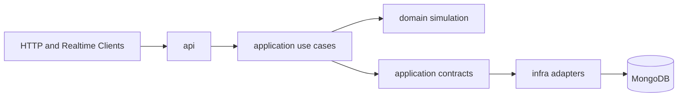

# Traffic Engine Architecture

Last updated: 2026-04-24

This file is the architecture source of truth for the repository.

## 1. Architectural Style

Traffic Engine uses layered hexagonal architecture.

1. Domain layer owns simulation behavior and business invariants.
2. Application layer owns use-case orchestration and interface contracts.
3. Infrastructure layer owns adapters for persistence, runtime execution, and external services.
4. API layer owns HTTP transport, validation, and dependency wiring.

Why this style:

1. Simulation logic stays independent from FastAPI and MongoDB concerns.
2. Realtime delivery and background execution can evolve without domain changes.
3. Ports-first contracts make TDD and implementation work parallelizable.

## 2. Layer Rules

Dependency rules are mandatory.

1. Domain must not import from application, infrastructure, or api modules.
2. Application may import domain and application contracts only.
3. Infrastructure may import application contracts and domain models for mapping.
4. API may import application contracts/use cases and infrastructure composition modules.
5. Raw environment variable access for MongoDB belongs only to infrastructure persistence modules.

## 3. Component Map

## 4. Realtime Session Scope

Required capability for this iteration:

1. Client submits all simulation parameters to create a realtime session.
2. Server starts execution in the background.
3. Produced ticks are streamed to connected clients.
4. Session metadata, runs, and ticks are persisted in MongoDB.
5. Reconnecting clients can recover ticks from persistent history.

## 5. Realtime Transport Decision

Chosen transport: SSE (Server-Sent Events) for this iteration.

Reasons:

1. Requirement is server-to-client tick delivery; SSE is a direct fit.
2. Browser and HTTP tooling support is simple for local/dev clients.
3. Built-in event id semantics align with replay and reconnect behavior.
4. Lower operational complexity than WebSocket for one-way streaming.

Trade-off accepted:

1. Bidirectional control messages are limited compared with WebSocket.
2. If future use cases need client-to-server realtime control channels, WebSocket can be introduced as an additional transport.

## 6. Background Execution Model

Current model: in-process background tasks in a single FastAPI process for local/dev.

Architecture contract:

1. API does not step simulation inline inside request handlers.
2. API calls an application-level RunExecutor port.
3. Infrastructure provides InProcessRunExecutor adapter backed by asyncio task registry.
4. Run loop persists each tick before publication to subscribers.

Future path:

1. Keep RunExecutor contract stable.
2. Replace in-process adapter with a worker-backed adapter without changing API or application contracts.
3. Worker-backed replacement is explicitly deferred as future backlog and is not a blocker for PIPELINE-011 close-out.

## 7. Persistence Contracts

Three repository contracts are required.

### 7.1 SimulationSessionRepository

Responsibility: metadata for realtime sessions.

Required operations:

1. create_session(session)
2. get_session(session_id)
3. update_session_status(session_id, status, updated_at)
4. update_session_latest_tick(session_id, run_id, tick_number, latest_metrics, updated_at)

### 7.2 SimulationRunRepository

Responsibility: execution attempts linked to sessions.

Required operations:

1. create_run(run)
2. get_run(run_id)
3. get_active_run_for_session(session_id)
4. mark_run_started(run_id, started_at, worker_id)
5. mark_run_completed(run_id, completed_at)
6. mark_run_failed(run_id, completed_at, error)

### 7.3 SimulationTickRepository

Responsibility: immutable tick history and replay reads.

Required operations:

1. append_tick(tick)
2. list_ticks_after(session_id, run_id, from_tick, limit)
3. get_latest_tick(session_id, run_id)

Repository rules:

1. Session documents must not contain unbounded tick arrays.
2. Tick history lives in simulation_ticks as one document per tick.
3. Idempotency relies on unique run_id + tick_number index.

## 8. Recovery Contract

Stream behavior for reconnect:

1. Endpoint accepts from_tick and optional Last-Event-ID.
2. Server replays persisted ticks where tick_number > from_tick in ascending order.
3. If follow=true and run is active, server continues streaming live ticks after replay.
4. Terminal run status event ends the stream.

SSE event types:

1. tick
2. run_status
3. heartbeat

## 9. API Coordination Contract

Session creation flow:

1. API validates request.
2. StartRealtimeSessionUseCase writes simulation_sessions and simulation_runs.
3. Use case submits run to RunExecutor.
4. API returns session_id and run_id immediately.

Background tick flow:

1. RunRealtimeSessionUseCase steps domain model.
2. Persist tick to simulation_ticks.
3. Update latest tick metadata on simulation_sessions.
4. Publish tick via TickStreamBroker.

## 10. MongoDB Connection Placement

Environment-driven MongoDB connection settings stay in:

1. src/traffic_engine/infrastructure/persistence/mongodb.py

Layer ownership rules:

1. Infrastructure repositories use this helper.
2. Application uses repositories via contracts only.
3. API startup/shutdown may call lifecycle helpers but does not run direct MongoDB queries.

## 11. Planned File Structure For Realtime Scope

New modules expected:

1. src/traffic_engine/application/contracts/realtime_persistence.py
Responsibility: session/run/tick repository protocols.
Layer: application.
May depend on: typing, dataclasses, domain models.
Must not depend on: FastAPI, pymongo.

2. src/traffic_engine/application/contracts/realtime_runtime.py
Responsibility: RunExecutor protocol and lifecycle result models.
Layer: application.
May depend on: typing, dataclasses.
Must not depend on: asyncio implementation details.

3. src/traffic_engine/application/contracts/realtime_streaming.py
Responsibility: Tick publish/subscribe contract.
Layer: application.
May depend on: typing, async protocol types.
Must not depend on: FastAPI response classes.

4. src/traffic_engine/application/use_cases/start_realtime_session.py
Responsibility: create session and run records, then dispatch background run.
Layer: application.
May depend on: application contracts, domain simulation interfaces.
Must not depend on: pymongo, FastAPI.

5. src/traffic_engine/application/use_cases/run_realtime_session.py
Responsibility: execute tick loop, persistence updates, and publish events.
Layer: application.
May depend on: domain model interface and repository/stream contracts.
Must not depend on: API models.

6. src/traffic_engine/application/use_cases/replay_and_stream_ticks.py
Responsibility: replay persisted ticks and append live stream subscription.
Layer: application.
May depend on: tick repository and stream contracts.
Must not depend on: infrastructure implementations.

7. src/traffic_engine/infrastructure/persistence/mongo_realtime_repositories.py
Responsibility: pymongo implementation of realtime repositories.
Layer: infrastructure.
May depend on: pymongo, mongodb helper, application contracts.
Must not depend on: API.

8. src/traffic_engine/infrastructure/runtime/in_process_run_executor.py
Responsibility: local/dev run scheduling and task lifecycle.
Layer: infrastructure.
May depend on: asyncio and application runtime contract.
Must not depend on: FastAPI request handlers.

9. src/traffic_engine/infrastructure/realtime/in_memory_tick_stream.py
Responsibility: in-process live tick fan-out adapter.
Layer: infrastructure.
May depend on: asyncio and application stream contract.
Must not depend on: persistence adapters.

10. src/traffic_engine/api/realtime_router.py
Responsibility: realtime HTTP and SSE endpoints.
Layer: api.
May depend on: application use cases and API models.
Must not depend on: pymongo.

## 12. Implementation Guardrails

1. Preserve current domain simulation behavior in src/traffic_engine/domain/simulation.
2. Keep existing non-realtime endpoints functional during this iteration.
3. Enforce one active run per session for this iteration.
4. Persist before publish for every tick.
5. Do not store tick history in session documents.

## 13. ADR Index

See DECISIONS.md for realtime ADRs added in this iteration.

1. ADR-008: SSE transport for realtime tick delivery and replay.
2. ADR-009: MongoDB persistence shape with separate session/run/tick collections.
3. ADR-010: In-process background execution with worker-ready abstraction.

## 14. Validation Snapshot (2026-04-24)

Validated implementation scope:

1. API composes realtime use cases and infrastructure adapters without direct Mongo query logic in handlers.
2. Application use cases depend on persistence/runtime/streaming ports, not on Mongo concrete classes.
3. MongoDB persistence remains isolated in infrastructure persistence modules.
4. Tick history is persisted as one document per tick in simulation_ticks, while sessions keep bounded latest metadata.
5. Replay uses Last-Event-ID precedence over from_tick when parseable, and run execution persists ticks before publish.

Corrections closed:

1. src/traffic_engine/infrastructure/runtime/manager_backed_simulation_model.py now depends on the application-owned SimulationRuntimeGateway contract and no longer imports API modules.
2. run_status terminal SSE events now emit numeric cursor ids based on the last persisted tick_number.
3. API shutdown now closes MongoDB client lifecycle helpers from infrastructure persistence after executor shutdown.

## 15. Tracked Architectural Debt And Future Backlog

1. Execution scalability is intentionally deferred beyond PIPELINE-011: InProcessRunExecutor remains the default local/dev adapter.
2. Future backlog: introduce a worker-backed RunExecutor adapter that preserves the current RunExecutor contract and API composition flow.
3. This deferred item is architectural debt to track, but it is non-blocking for the current realtime pipeline scope.
