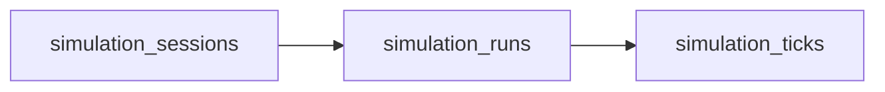

# Database Schema

## Collection Relationships

| Collection | Cardinality | Mutability |
| --- | --- | --- |
| `simulation_sessions` | One per public realtime session | Mutable summary document; keeps latest run and latest tick pointers |
| `simulation_runs` | One per execution attempt | New document for each extension run; lifecycle timestamps update in place |
| `simulation_ticks` | One per persisted tick | Immutable replay history |

## Lifecycle Semantics

The database stores internal lifecycle values. Public HTTP responses and the canonical WebSocket contract normalize them before exposing them to clients.

| Layer | Pending | Running | Finished | Failed | Cancelled |
| --- | --- | --- | --- | --- | --- |
| Session values stored in MongoDB | `pending` | `running`, `paused` | `completed` | `failed` | `cancelled` |
| Run values stored in MongoDB | `queued` | `running` | `completed` | `failed` | `cancelled` |
| Public contract | `pending` | `running` | `finished` | `failed` | `cancelled` |

## `simulation_sessions`

| Field | Type | Required | Description |
| --- | --- | --- | --- |
| `_id` | `string` | Yes | Application-defined primary key |
| `session_id` | `string` | Yes | Stable public session identifier |
| `created_at` | `date` | Yes | UTC creation timestamp |
| `updated_at` | `date` | Yes | UTC timestamp of the latest metadata change |
| `status` | `string` | Yes | Internal session lifecycle: `pending`, `running`, `paused`, `completed`, `failed`, or `cancelled` |
| `simulation_parameters` | `object` | Yes | Normalized simulation parameters captured for the session |
| `latest_run_id` | `string \| null` | No | Most recent run identifier |
| `latest_tick` | `int \| long \| null` | No | Highest persisted tick number across the latest run |
| `latest_metrics` | `object \| null` | No | Compact metrics summary used by dashboards and reconnect flows |

## `simulation_runs`

| Field | Type | Required | Description |
| --- | --- | --- | --- |
| `_id` | `string` | Yes | Application-defined primary key |
| `run_id` | `string` | Yes | Stable public run identifier |
| `session_id` | `string` | Yes | Owning session identifier |
| `created_at` | `date` | Yes | UTC creation timestamp |
| `started_at` | `date \| null` | No | UTC timestamp when background execution starts |
| `completed_at` | `date \| null` | No | UTC timestamp when the run finishes or fails |
| `status` | `string` | Yes | Internal run lifecycle: `queued`, `running`, `completed`, `failed`, or `cancelled` |
| `runtime` | `object` | Yes | Persisted runtime configuration for this run |
| `parameters_snapshot` | `object \| null` | No | Immutable parameter snapshot for the run |
| `error` | `object \| null` | No | Structured terminal error payload |

Each extension creates a new `simulation_runs` document. Previous runs are not rewritten or removed.

## `simulation_ticks`

| Field | Type | Required | Description |
| --- | --- | --- | --- |
| `session_id` | `string` | Yes | Owning session identifier |
| `run_id` | `string` | Yes | Execution identifier that produced the tick |
| `tick_number` | `int \| long` | Yes | Monotonic cursor within the run |
| `recorded_at` | `date` | Yes | UTC persistence timestamp |
| `metrics` | `object` | Yes | Compact metrics payload for replay and dashboards |
| `snapshot` | `object \| null` | No | Visualization payload captured for the tick |
| `events` | `array \| null` | No | Tick-local annotations |

Ticks are appended before live publication, so replay and live follow share the same durable history.

## Indexes

| Collection | Fields | Type | Reason |
| --- | --- | --- | --- |
| `simulation_sessions` | `session_id` | Unique | Session lookup |
| `simulation_sessions` | `status, updated_at` | Compound | Public lifecycle filtering and recent-session dashboards |
| `simulation_sessions` | `created_at` | Standard | Recent-session administration |
| `simulation_runs` | `run_id` | Unique | Direct run lookup |
| `simulation_runs` | `session_id, created_at` | Compound | Run history for a session |
| `simulation_runs` | `session_id, status, created_at` | Compound | Active-run guard and status-filtered history |
| `simulation_runs` | `status, created_at` | Compound | Operator scans for active executions |
| `simulation_ticks` | `run_id, tick_number` | Unique compound | Idempotent tick persistence |
| `simulation_ticks` | `session_id, recorded_at` | Compound | Time-ordered session recovery |
| `simulation_ticks` | `session_id, run_id, tick_number` | Compound | Ordered replay by session, run, and cursor |
