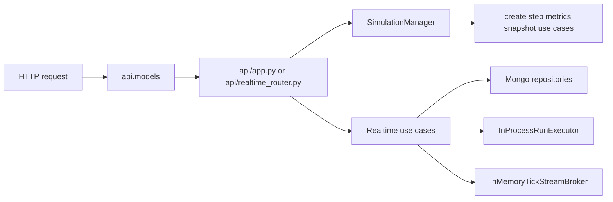
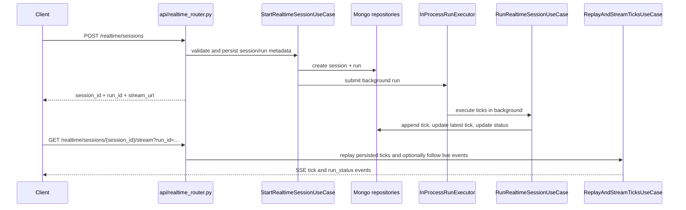

# Traffic Engine API

## Purpose

The FastAPI surface exposes two contracts:

| Surface | Scope |
| --- | --- |
| Synchronous HTTP | Create, step, inspect, and delete in-memory simulations |
| Realtime HTTP + SSE | Create persisted realtime sessions, replay stored ticks, and follow live events |

## Request and Response Paths



## Endpoints

| Method | Path | Purpose | Main Response |
| --- | --- | --- | --- |
| `POST` | `/simulations` | Create a synchronous simulation | `CreateSimulationResponse` |
| `POST` | `/simulations/{simulation_id}/step` | Advance one simulation by `n_ticks` | `StepSimulationResponse` |
| `GET` | `/simulations/{simulation_id}/metrics` | Read aggregate metrics and optional history | `GetMetricsResponse` |
| `GET` | `/simulations/{simulation_id}/snapshot` | Read detailed state for visualization | `GetSnapshotResponse` |
| `DELETE` | `/simulations/{simulation_id}` | Remove a simulation instance | plain message dict |
| `GET` | `/simulations` | List active in-memory simulations | plain dict with `simulations` and `count` |
| `GET` | `/health` | Health probe | plain status dict |
| `POST` | `/realtime/sessions` | Create a persisted realtime session and queue background execution | `CreateRealtimeSessionResponse` |
| `GET` | `/realtime/sessions/{session_id}/stream` | Replay persisted ticks and optionally continue with live SSE events | `text/event-stream` |

## Synchronous Models

| Model | Key Fields | Notes |
| --- | --- | --- |
| `CreateSimulationRequest` | `area`, `bbox`, `config` | Internal DTO requires exactly one of `area` or `bbox` |
| `StepSimulationRequest` | `n_ticks`, `actions` | `n_ticks` is constrained to `1..100` |
| `GetMetricsRequest` | `include_history`, `window_ticks` | `window_ticks` defaults to `60` |
| `GetSnapshotRequest` | `include_vehicle_details`, `include_edge_data`, `vehicle_types_filter` | Filter values are validated against `VehicleType` |

## Realtime Models

| Model | Key Fields | Notes |
| --- | --- | --- |
| `CreateRealtimeSessionRequest` | `session_id`, `run_id`, `area`, `bbox`, `config`, `runtime` | Requires either `area` or `bbox` |
| `RealtimeRuntimeConfig` | `mode`, `tick_interval_ms`, `max_ticks` | Default mode is `realtime` |
| `CreateRealtimeSessionResponse` | `session_id`, `run_id`, `status`, `stream_url` | `stream_url` includes the created `run_id` |

## Realtime Flow



## SSE Recovery Contract

| Input or Event | Behavior |
| --- | --- |
| `run_id` | Required query parameter for replay/follow scope |
| `from_tick` | Replays ticks where `tick_number > from_tick` |
| `Last-Event-ID` | Takes precedence over `from_tick` when parseable as an integer |
| `follow=true` | Replays history first and then continues with live broker events |
| `event: tick` | Uses numeric `id` equal to `tick_number` |
| `event: run_status` | Terminal event for completed or failed runs |

## Typical Payloads

### Create Simulation

```json
{
  "area": "Polanco, Ciudad de Mexico",
  "config": {
    "initial_vehicles": 50,
    "max_vehicles": 1000,
    "spawn_rate": 0.08,
    "noise_prob": 0.28
  }
}
```

### Create Realtime Session

```json
{
  "area": "Roma Norte, Ciudad de Mexico",
  "config": {
    "initial_vehicles": 16,
    "spawn_rate": 0.2,
    "noise_prob": 0.1
  },
  "runtime": {
    "mode": "realtime",
    "tick_interval_ms": 250,
    "max_ticks": 100
  }
}
```

### Follow Realtime Stream

```text
GET /realtime/sessions/{session_id}/stream?run_id={run_id}&from_tick=42&follow=true
Last-Event-ID: 42
```

## Error Behavior

| Situation | Behavior |
| --- | --- |
| Invalid request body or query params | FastAPI/Pydantic returns validation error |
| Invalid `vehicle_types_filter` value | API raises HTTP `422` with enum guidance |
| Missing synchronous simulation ID during delete | API returns `404` |
| Missing Mongo env vars or `pymongo` for realtime composition | Realtime router returns `503` |
| Duplicate active realtime run for a session | Start use case raises a validation failure |
| Run-time failure in background execution | Run status is marked failed and a terminal `run_status` event is emitted |

## Maintainer Notes

| Concern | Location |
| --- | --- |
| Synchronous route declarations | `src/traffic_engine/api/app.py` |
| Realtime route declarations | `src/traffic_engine/api/realtime_router.py` |
| Public schema changes | `src/traffic_engine/api/models/` |
| In-memory synchronous session policy | `src/traffic_engine/api/simulation_manager.py` |
| Realtime persistence composition | `src/traffic_engine/infrastructure/persistence/` |
