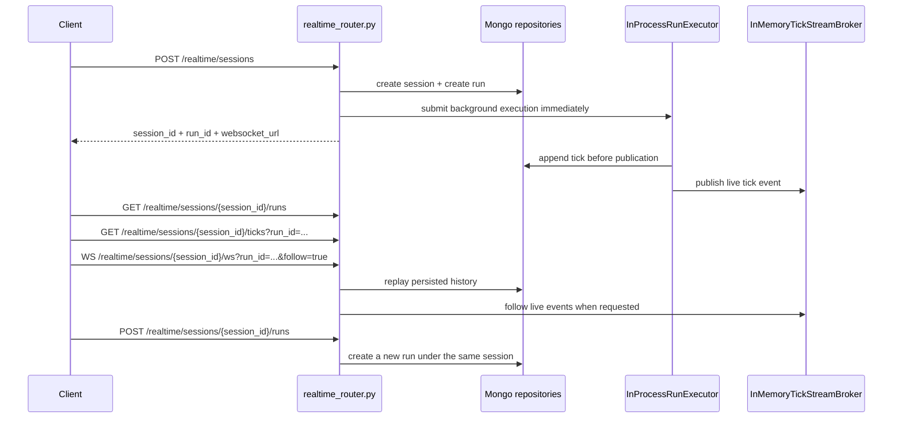

# Traffic Engine API

## Purpose

This page focuses on the persisted realtime contract used by PIPELINE-011. The synchronous `/simulations` routes still exist, but the end-to-end workflow below is the canonical public surface for durable replay, live follow, and extension.

| Surface | Contract |
| --- | --- |
| Synchronous HTTP | Create, step, inspect, and delete in-memory `/simulations` sessions |
| Persisted realtime HTTP + WebSocket | Create background realtime sessions, browse persisted history, replay runs, and extend finished sessions |

| Transport | Status | Notes |
| --- | --- | --- |
| `WS /realtime/sessions/{session_id}/ws` | Canonical | Normalized JSON event envelopes for replay and live follow |
| `GET /realtime/sessions/{session_id}/stream` | Compatibility | SSE remains available for legacy consumers; prefer WebSocket for new clients |

## Realtime Request Flow



## Public Lifecycle Vocabulary

All public realtime responses and canonical WebSocket status events use the same lifecycle vocabulary.

| Public value | Normalized from persisted/runtime values | Meaning |
| --- | --- | --- |
| `pending` | session `pending`, run `queued` | Metadata exists and execution has been accepted but not started yet |
| `running` | session `running` or `paused`, run `running` | Ticks may still be produced |
| `finished` | session `completed`, run `completed` | Terminal success; eligible for replay and extension |
| `failed` | session `failed`, run `failed` | Terminal failure |
| `cancelled` | session `cancelled`, run `cancelled`, `canceled` | Terminal cancellation |

## Realtime Endpoint Map

| Method | Path | Purpose | Notes |
| --- | --- | --- | --- |
| `GET` | `/realtime/status` | Check whether Mongo-backed realtime persistence is available | Safe health-style probe for clients and dashboards |
| `POST` | `/realtime/sessions` | Create a persisted realtime session and dispatch background execution | Returns the canonical `websocket_url` |
| `GET` | `/realtime/sessions` | List persisted sessions | `status` filter uses public lifecycle values |
| `GET` | `/realtime/sessions/{session_id}/runs` | List persisted runs for one session | Historical runs remain replayable |
| `GET` | `/realtime/sessions/{session_id}/ticks` | Read persisted ticks for one run | Ordered by ascending `tick_number` |
| `WS` | `/realtime/sessions/{session_id}/ws` | Replay persisted events and optionally continue live | Canonical transport |
| `GET` | `/realtime/sessions/{session_id}/stream` | Replay and follow via SSE | Compatibility transport |
| `POST` | `/realtime/sessions/{session_id}/runs` | Extend a finished session with a new run | Creates a new `run_id`; does not recreate the session |

## Availability And Creation

### `GET /realtime/status`

| Field | Type | Meaning |
| --- | --- | --- |
| `available` | `bool` | Whether realtime persistence can be used |
| `status` | `string` | Availability label, typically `available` or `unavailable` |
| `message` | `string` | Client-safe explanation |

### `POST /realtime/sessions`

One of `area` or `bbox` is required. `runtime` defaults to realtime mode with `tick_interval_ms=250` and `max_ticks=100`.

| Request field | Type | Required | Meaning |
| --- | --- | --- | --- |
| `session_id` | `string` | No | Optional client-supplied session identifier |
| `run_id` | `string` | No | Optional client-supplied run identifier |
| `area` | `string` | Conditionally | Named area for initialization |
| `bbox` | `object` | Conditionally | Bounding box with `min_x`, `max_x`, `min_y`, `max_y` |
| `config` | `object` | No | Simulation parameter overrides |
| `runtime.mode` | `string` | No | Execution mode; defaults to `realtime` |
| `runtime.tick_interval_ms` | `int` | No | Delay between ticks in milliseconds |
| `runtime.max_ticks` | `int` | No | Maximum ticks for the created run |

| Response field | Type | Meaning |
| --- | --- | --- |
| `session_id` | `string` | Stable realtime session identifier |
| `run_id` | `string` | Run identifier created for this execution |
| `session_status` | `string` | Canonical public session status |
| `run_status` | `string` | Canonical public run status |
| `status` | `string` | Temporary alias of `run_status` |
| `websocket_url` | `string` | Canonical WebSocket URL for replay and live follow |
| `stream_url` | `string \/ null` | Convenience SSE URL for compatibility clients |

```json
{
  "area": "Roma Norte, Ciudad de Mexico",
  "config": {
    "initial_vehicles": 16,
    "spawn_rate": 0.2,
    "noise_prob": 0.1
  },
  "runtime": {
    "mode": "realtime",
    "tick_interval_ms": 250,
    "max_ticks": 100
  }
}
```

```json
{
  "session_id": "session-realtime-001",
  "run_id": "run-realtime-001",
  "session_status": "pending",
  "run_status": "pending",
  "status": "pending",
  "websocket_url": "ws://localhost:8000/realtime/sessions/session-realtime-001/ws?run_id=run-realtime-001",
  "stream_url": "http://localhost:8000/realtime/sessions/session-realtime-001/stream?run_id=run-realtime-001"
}
```

## Persisted History Queries

### `GET /realtime/sessions`

| Query field | Default | Meaning |
| --- | --- | --- |
| `status` | unset | Optional public status filter: `pending`, `running`, `finished`, `failed`, `cancelled` |
| `limit` | `50` | Maximum sessions to return, `1..500` |

| Session field | Meaning |
| --- | --- |
| `session_id` | Stable session identifier |
| `created_at`, `updated_at` | UTC timestamps |
| `status` | Canonical public lifecycle value |
| `simulation_parameters` | Normalized parameters captured for the session |
| `latest_run_id` | Most recent run for replay or live follow |
| `latest_tick` | Highest persisted tick number |
| `latest_metrics` | Latest persisted metrics summary |

### `GET /realtime/sessions/{session_id}/runs`

| Query field | Default | Meaning |
| --- | --- | --- |
| `limit` | `50` | Maximum runs to return, `1..500` |

| Run field | Meaning |
| --- | --- |
| `run_id` | Stable run identifier |
| `session_id` | Owning session |
| `created_at`, `started_at`, `completed_at` | UTC lifecycle timestamps |
| `status` | Canonical public lifecycle value |
| `runtime` | Persisted runtime configuration for the run |
| `parameters_snapshot` | Immutable parameter snapshot captured when the run was created |
| `error` | Structured terminal error payload when the run fails |

Historical runs remain queryable after extension. Creating a new run under a session does not overwrite earlier `simulation_runs` documents.

### `GET /realtime/sessions/{session_id}/ticks`

| Query field | Default | Meaning |
| --- | --- | --- |
| `run_id` | none | Required run identifier |
| `from_tick` | `-1` | Return ticks where `tick_number > from_tick` |
| `limit` | `200` | Maximum ticks to return, `1..1000` |

| Tick field | Meaning |
| --- | --- |
| `session_id`, `run_id` | Owning identifiers |
| `tick_number` | Persisted cursor for replay |
| `recorded_at` | UTC persistence timestamp |
| `metrics` | Compact metrics snapshot for the tick |
| `snapshot` | Visualization payload captured for the tick |
| `events` | Structured tick-local annotations |

Each tick is written to MongoDB before live publication. The tick history endpoint and the WebSocket replay phase read the same persisted source of truth.

## Canonical WebSocket Contract

### `WS /realtime/sessions/{session_id}/ws`

| Query field | Default | Meaning |
| --- | --- | --- |
| `run_id` | latest run for the session | Run to replay and optionally follow |
| `from_tick` | `-1` | Replay ticks where `tick_number > from_tick` |
| `follow` | `true` | Continue with live events after replay |

| Behavior | Result |
| --- | --- |
| `run_id` omitted | The route resolves `latest_run_id` for the session |
| `follow=false` | Replay only; stop after persisted history |
| `follow=true` | Replay persisted history first, then continue with live broker events |
| Missing session run | Send `event=error`, then close with code `4404` |
| Run does not belong to session | Send `event=error`, then close with code `4404` |

Every WebSocket message uses the same top-level envelope.

| Envelope field | Type | Meaning |
| --- | --- | --- |
| `event` | `string` | Event type: `tick`, `run_status`, or `error` |
| `session_id` | `string` | Owning session |
| `run_id` | `string` | Owning run |
| `cursor` | `int` | Replay cursor, usually the tick number |
| `sent_at` | `string` | ISO-8601 timestamp for the emitted envelope |
| `data` | `object` | Event-specific payload |

#### `tick` Event Payload

| Field | Meaning |
| --- | --- |
| `tick_number` | Persisted tick number |
| `recorded_at` | ISO-8601 persistence timestamp |
| `metrics` | Tick metrics payload |
| `snapshot` | Per-tick visualization payload |
| `events` | Tick-local annotations |

#### `run_status` Event Payload

| Field | Meaning |
| --- | --- |
| `status` | Canonical public lifecycle value |
| `terminal` | `true` when the run is finished, failed, or cancelled |
| `error` | Structured terminal error payload or `null` |

#### `error` Event Payload

| Field | Meaning |
| --- | --- |
| `message` | Human-readable error description before the socket closes |

```json
{
  "event": "tick",
  "session_id": "session-realtime-001",
  "run_id": "run-realtime-001",
  "cursor": 42,
  "sent_at": "2026-04-25T12:34:56.000000+00:00",
  "data": {
    "tick_number": 42,
    "recorded_at": "2026-04-25T12:34:56.000000+00:00",
    "metrics": {
      "tick": 42,
      "density": 0.31
    },
    "snapshot": {
      "meta": {
        "tick": 42
      }
    },
    "events": []
  }
}
```

```json
{
  "event": "run_status",
  "session_id": "session-realtime-001",
  "run_id": "run-realtime-001",
  "cursor": 42,
  "sent_at": "2026-04-25T12:35:10.000000+00:00",
  "data": {
    "status": "finished",
    "terminal": true,
    "error": null
  }
}
```

## Compatibility SSE Stream

### `GET /realtime/sessions/{session_id}/stream`

| Input | Meaning |
| --- | --- |
| `run_id` | Required run identifier |
| `from_tick` | Replay ticks where `tick_number > from_tick` |
| `follow` | Continue with live SSE events after replay |
| `Last-Event-ID` | When numeric, takes precedence over `from_tick` for reconnects |

SSE is kept for compatibility. It uses `text/event-stream` framing with `event`, `id`, and `data` lines. New clients should use WebSocket because the stable public event envelope lives there.

```text
event: tick
id: 42
data: {"session_id":"session-realtime-001","run_id":"run-realtime-001","tick_number":42}
```

## Extend A Finished Session

### `POST /realtime/sessions/{session_id}/runs`

Preconditions:

| Requirement | Why it matters |
| --- | --- |
| The session exists | Extension reuses the existing session metadata |
| The public session status is `finished` | Only completed history can be extended |
| No run is currently active for the session | The session may only have one active run at a time |

| Request field | Type | Required | Meaning |
| --- | --- | --- | --- |
| `n_steps` | `int` | Yes | Additional ticks to execute in the new run |
| `tick_interval_ms` | `int` | No | Optional delay between extension ticks |
| `mode` | `string` | No | Optional runtime mode override |
| `run_id` | `string` | No | Optional client-supplied run identifier |

The response shape matches `POST /realtime/sessions`. A successful extension creates a new `run_id`, resets the session to `pending`, and keeps older runs immutable and replayable.

```json
{
  "n_steps": 25,
  "tick_interval_ms": 100
}
```

```json
{
  "session_id": "session-realtime-001",
  "run_id": "run-realtime-002",
  "session_status": "pending",
  "run_status": "pending",
  "status": "pending",
  "websocket_url": "ws://localhost:8000/realtime/sessions/session-realtime-001/ws?run_id=run-realtime-002",
  "stream_url": "http://localhost:8000/realtime/sessions/session-realtime-001/stream?run_id=run-realtime-002"
}
```

## Common Failure Modes

| Situation | Behavior |
| --- | --- |
| Invalid request body or query params | FastAPI or Pydantic returns HTTP `422` |
| Realtime persistence is unavailable | `/realtime/status` reports `available=false`; realtime routes return HTTP `503` |
| WebSocket run is missing or belongs to another session | Socket emits `event=error` and closes with code `4404` |
| Background execution fails | Historical run becomes `failed`; canonical WebSocket emits a terminal `run_status` event |
