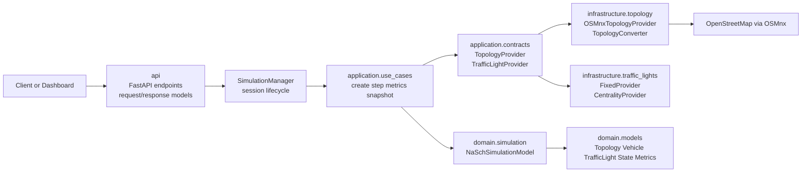
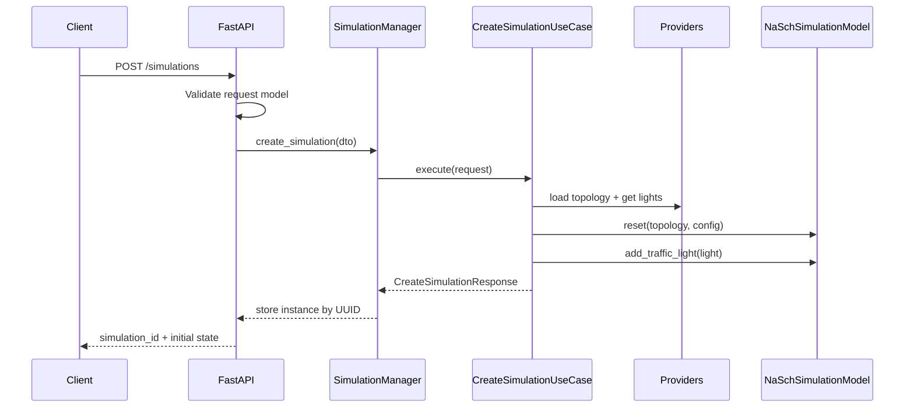

# Traffic Engine Architecture

## Purpose

Traffic Engine is a layered Python service that turns OpenStreetMap road data into a cellular traffic simulation and exposes that simulation through FastAPI.

## Audience

| Audience | Use This Doc For |
| --- | --- |
| New developers | Learn the main runtime path and where code lives |
| Maintainers | Locate ownership boundaries and extension points |

## Component Map

## Responsibilities

| Layer | Main Modules | Responsibility |
| --- | --- | --- |
| API | `src/traffic_engine/api/app.py`, `src/traffic_engine/api/models/` | HTTP endpoints, query/body validation, DTO conversion, public response schema |
| Session orchestration | `src/traffic_engine/api/simulation_manager.py` | Create and track concurrent simulations, bind use cases to a model instance, cleanup policy |
| Application | `src/traffic_engine/application/use_cases/`, `src/traffic_engine/application/contracts/` | Use-case orchestration and boundary contracts between API, providers, and domain |
| Domain | `src/traffic_engine/domain/models/`, `src/traffic_engine/domain/simulation/` | Traffic model, NaSch rules, cellular grid, vehicle/light/state models |
| Infrastructure | `src/traffic_engine/infrastructure/` | OSMnx download, graph conversion, traffic-light placement strategies |
| Tests | `tests/` | Contract-level coverage for API, use cases, providers, domain models, and simulation rules |

## Main Runtime Flow

## Data Flow by Operation

| Operation | Entry Point | Core Path | Output |
| --- | --- | --- | --- |
| Create simulation | `POST /simulations` | API model -> DTO -> `CreateSimulationUseCase` -> topology provider -> light provider -> `NaSchSimulationModel.reset()` | `simulation_id`, initial state, topology summary |
| Step simulation | `POST /simulations/{id}/step` | API model -> DTO -> `StepSimulationUseCase` -> `SimulationModel.step()` | new tick, metrics, spawn/remove counts |
| Metrics | `GET /simulations/{id}/metrics` | query params -> DTO -> `GetMetricsUseCase` -> `get_state()` + `get_metrics()` | current metrics and optional history |
| Snapshot | `GET /simulations/{id}/snapshot` | query params -> DTO -> `GetSnapshotUseCase` -> `get_state()` | visualization-friendly vehicle, light, and edge data |

## Design Decisions Reflected in Code

| Decision | Current Implementation | Why It Matters |
| --- | --- | --- |
| Layered architecture with ports | Provider protocols live in `application.contracts`; implementations live in `infrastructure` | Keeps OSMnx and traffic-light strategies replaceable |
| Model abstraction | `SimulationModel` protocol defines `reset`, `step`, `get_state`, `get_metrics`, `get_observation` | Allows other simulation engines without changing use cases |
| Session-per-simulation | `SimulationManager` stores one `NaSchSimulationModel` and one use-case bundle per UUID | Supports concurrent simulations over HTTP |
| Domain-first state types | `SimulationState`, `Metrics`, `SnapshotData`, `VehicleState`, `LightState` are plain dataclasses | Keeps API serialization separate from simulation logic |
| Optional heavy dependencies | OSMnx and NetworkX are import-guarded in infrastructure modules | The package can still import even if topology backends are unavailable |

## Current Defaults and Limits

| Setting | Value | Source |
| --- | --- | --- |
| Cell size | `5.0 m` | `src/traffic_engine/config/constants.py` |
| Tick duration | `1.0 s` | `src/traffic_engine/config/constants.py` |
| Max cellular speed | `5 cells/tick` | `src/traffic_engine/config/constants.py` |
| Base noise probability | `0.28` | `src/traffic_engine/config/constants.py` |
| Vehicle timeout | `50 ticks` | `src/traffic_engine/config/constants.py` |
| Default signal cycle | `30 ticks` | `src/traffic_engine/config/constants.py` |

## Extension Points

| Extension | Where to Change |
| --- | --- |
| New topology backend | Add a `TopologyProvider` implementation in `infrastructure/topology` |
| New signal strategy | Add a `TrafficLightProvider` implementation in `infrastructure/traffic_lights` |
| New simulation engine | Implement the `SimulationModel` protocol in `domain/simulation` |
| New API response shape | Update `api/models/` and DTO conversion helpers in `api/app.py` |

## Known Gaps

| Gap | Effect |
| --- | --- |
| Root planning docs describe some endpoints not present in the current FastAPI app | This doc follows the implemented routes in `api/app.py` |
| `SimulationManager` currently defaults to `FixedTrafficLightProvider`, while a centrality-based provider also exists | Signal placement is replaceable; the default runtime path is simpler than the architectural plan |

## Realtime Session Extension (Implemented)

Realtime session support is now implemented with MongoDB persistence and SSE replay/follow behavior.

### Current Scope Coverage

1. Create realtime sessions from simulation parameters.
2. Dispatch execution in background without blocking API requests.
3. Persist session metadata, execution runs, and immutable per-tick documents in MongoDB.
4. Replay persisted ticks and optionally continue with live SSE events.

### Current Transport Contract

1. SSE endpoint replays ticks with tick_number greater than the reconnect cursor.
2. Last-Event-ID takes precedence over from_tick when parseable.
3. Tick event id values are numeric tick cursors.
4. Terminal events end the follow stream.

### Current Runtime and Persistence Ownership

1. Application layer defines ports for repositories, run execution, and stream broker behavior.
2. Infrastructure layer owns Mongo repositories, in-memory stream broker, and in-process run executor.
3. API layer composes adapters and invokes use cases.
4. MongoDB environment settings remain centralized in infrastructure persistence helpers.

### PIPELINE-011 Close-out Status

1. src/traffic_engine/infrastructure/runtime/manager_backed_simulation_model.py now depends on the application-owned SimulationRuntimeGateway contract and no longer imports API modules.
2. Terminal run_status SSE events now publish numeric cursor ids derived from the last persisted tick.
3. api/app.py shutdown now closes infrastructure MongoDB client lifecycle helpers after realtime executor shutdown.
4. In-process execution remains the default local/dev adapter, while worker-backed RunExecutor replacement is tracked as future backlog and is not part of the active PIPELINE-011 TODO set.

### Realtime Runtime Backlog (Post PIPELINE-011)

1. Keep the RunExecutor application contract unchanged.
2. Implement and validate a worker-backed adapter in a future pipeline for higher-throughput deployments.
3. Add restart reconciliation rules for active runs when execution moves beyond in-process local/dev.
