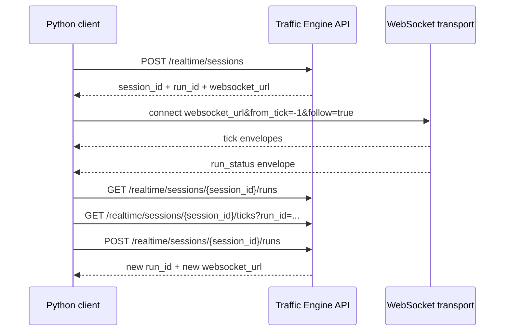

# Consume The Traffic Engine Service From Python

## Purpose

This guide shows the canonical persisted realtime workflow from Python: create a session, connect to the live WebSocket, replay durable history, extend a finished run, and query the stored catalog.

See also:

- [API contract](./API.md)
- [Local MongoDB setup](./MONGODB_LOCAL.md)

## Install

```bash
python -m pip install requests websocket-client
```

## Prerequisites

| Requirement | Default | Notes |
| --- | --- | --- |
| API base URL | `http://localhost:8000` | Realtime endpoints live under `/realtime/*` |
| MongoDB-backed realtime | enabled | Required for create, history, replay, and extension |
| Canonical live transport | WebSocket | Use `websocket_url` from the create or extend response |
| Compatibility transport | SSE | `stream_url` still exists for legacy consumers |

## Realtime Workflow



## Shared Setup

```python
import json

import requests
from websocket import create_connection

BASE_URL = "http://localhost:8000"
http = requests.Session()
```

## 1. Create A Persisted Realtime Session

```python
payload = {
    "area": "Roma Norte, Ciudad de Mexico",
    "config": {
        "initial_vehicles": 16,
        "spawn_rate": 0.2,
        "noise_prob": 0.1,
    },
    "runtime": {
        "mode": "realtime",
        "tick_interval_ms": 250,
        "max_ticks": 40,
    },
}

created = http.post(f"{BASE_URL}/realtime/sessions", json=payload, timeout=10).json()

session_id = created["session_id"]
run_id = created["run_id"]
websocket_url = created["websocket_url"]

print(created["session_status"], created["run_status"], websocket_url)
```

Expected response fields:

| Field | Meaning |
| --- | --- |
| `session_id` | Stable session identifier |
| `run_id` | Run identifier for the created execution |
| `session_status`, `run_status` | Public lifecycle values |
| `websocket_url` | Canonical live and replay URL |
| `stream_url` | Optional SSE compatibility URL |

## 2. Follow The Canonical WebSocket Live Stream

The returned `websocket_url` already includes `run_id`. Add `from_tick` and `follow` to control replay and live follow.

```python
live_url = websocket_url + "&from_tick=-1&follow=true"

ws = create_connection(live_url, timeout=10)
try:
    while True:
        event = json.loads(ws.recv())
        if event["event"] == "tick":
            tick_number = event["data"]["tick_number"]
            density = event["data"].get("metrics", {}).get("density")
            print("tick", tick_number, "density", density)
            continue

        if event["event"] == "run_status":
            print("terminal", event["data"]["status"])
            break

        if event["event"] == "error":
            raise RuntimeError(event["data"]["message"])
finally:
    ws.close()
```

## 3. Replay History Only Or Replay Then Follow

| Goal | URL pattern |
| --- | --- |
| Replay from the beginning and stop | `.../ws?run_id=...&from_tick=-1&follow=false` |
| Replay after tick `25` and stop | `.../ws?run_id=...&from_tick=25&follow=false` |
| Replay after tick `25` and keep following live | `.../ws?run_id=...&from_tick=25&follow=true` |

```python
replay_only_url = websocket_url + "&from_tick=25&follow=false"

ws = create_connection(replay_only_url, timeout=10)
try:
    replayed_ticks = []
    while True:
        event = json.loads(ws.recv())
        if event["event"] != "tick":
            break
        replayed_ticks.append(event["data"]["tick_number"])
finally:
    ws.close()

print(replayed_ticks)
```

## 4. Query Persisted History

```python
sessions_payload = http.get(
    f"{BASE_URL}/realtime/sessions",
    params={"status": "finished", "limit": 20},
    timeout=10,
).json()

runs_payload = http.get(
    f"{BASE_URL}/realtime/sessions/{session_id}/runs",
    params={"limit": 20},
    timeout=10,
).json()

ticks_payload = http.get(
    f"{BASE_URL}/realtime/sessions/{session_id}/ticks",
    params={"run_id": run_id, "from_tick": 10, "limit": 50},
    timeout=10,
).json()

print([session["session_id"] for session in sessions_payload["sessions"]])
print([run["run_id"] for run in runs_payload["runs"]])
print([tick["tick_number"] for tick in ticks_payload["ticks"]])
```

Use public status filters only: `pending`, `running`, `finished`, `failed`, `cancelled`.

## 5. Extend A Finished Session With `n_steps`

Extending a session creates a new run under the same session. Older runs remain immutable and replayable.

```python
extension = http.post(
    f"{BASE_URL}/realtime/sessions/{session_id}/runs",
    json={
        "n_steps": 25,
        "tick_interval_ms": 100,
    },
    timeout=10,
).json()

new_run_id = extension["run_id"]
new_websocket_url = extension["websocket_url"] + "&follow=true"

print(extension["session_id"], new_run_id, extension["run_status"])
print(new_websocket_url)
```

## 6. Minimal History-Then-Extension Loop

```python
finished_runs = http.get(
    f"{BASE_URL}/realtime/sessions/{session_id}/runs",
    params={"limit": 10},
    timeout=10,
).json()["runs"]

latest_finished = next(run for run in finished_runs if run["status"] == "finished")

history = http.get(
    f"{BASE_URL}/realtime/sessions/{session_id}/ticks",
    params={"run_id": latest_finished["run_id"], "from_tick": -1, "limit": 200},
    timeout=10,
).json()["ticks"]

print("replayed", len(history), "ticks from", latest_finished["run_id"])

extension = http.post(
    f"{BASE_URL}/realtime/sessions/{session_id}/runs",
    json={"n_steps": 10},
    timeout=10,
).json()

print("new run", extension["run_id"])
```

## Compatibility Note

| Endpoint | When to use it |
| --- | --- |
| `websocket_url` | Preferred for all new clients |
| `stream_url` | Only when you still need SSE framing or `Last-Event-ID` reconnect behavior |

SSE may still exist in deployments that need it, but the stable public event envelope is the WebSocket JSON message documented in [API.md](./API.md).
