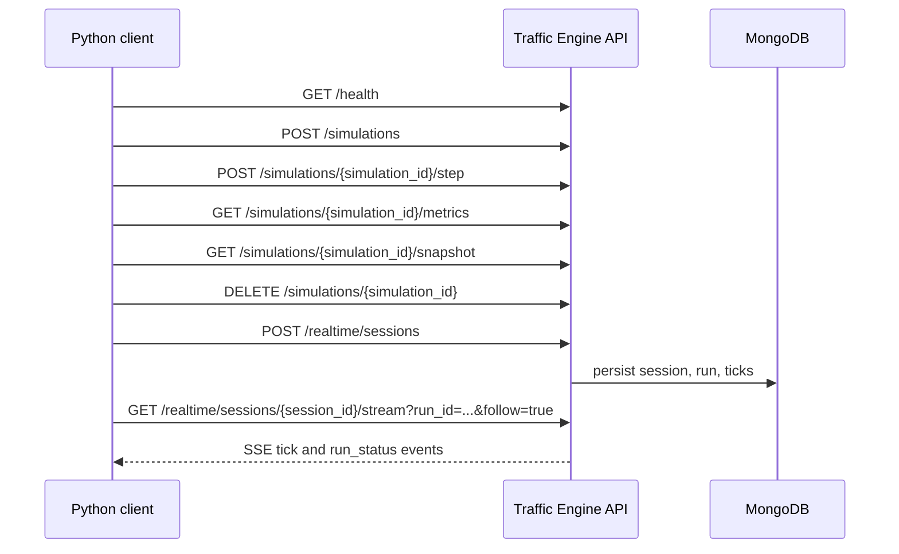

# Consume The Traffic Engine Service From Python

## Purpose

This guide shows external Python clients how to consume the Traffic Engine HTTP API for both synchronous simulations and realtime SSE streaming.

See also:

- [API contract](./API.md)
- [Local MongoDB setup for realtime](./MONGODB_LOCAL.md)

## Audience

| Audience | Use this guide for |
| --- | --- |
| API consumer | Calling the service from a Python application, script, worker, or notebook |
| Integrator | Wiring health checks, retries, timeouts, and SSE reconnect logic |

## Prerequisites

| Requirement | Needed for | Notes |
| --- | --- | --- |
| Running API server | All requests | Default base URL is `http://localhost:8000` |
| MongoDB configured | Realtime endpoints only | Required for `/realtime/*` routes |
| Python 3.8+ | Client examples | Examples use standard library plus `requests` |
| `requests` | All examples | Install with `pip install requests` |
| `httpx` | Optional | Only if you prefer it for async or alternate HTTP examples |
| No extra SSE package | Realtime examples | The SSE parser below uses `requests.iter_lines()` |

## Start The Service

### Synchronous API only

```bash
cd /home/erick/Desktop/github/Engine
uvicorn traffic_engine.api.app:app --reload
```

### Realtime API with MongoDB

```bash
cd /home/erick/Desktop/github/Engine
cp .env.example .env
docker compose up -d mongodb
uvicorn traffic_engine.api.app:app --reload
```

If realtime requests return HTTP `503`, validate the MongoDB environment described in [docs/MONGODB_LOCAL.md](./MONGODB_LOCAL.md).

## Request Map



## Install Client Dependencies

```bash
python -m pip install requests
```

Optional:

```bash
python -m pip install httpx
```

## Base URL And Timeouts

| Setting | Recommended default |
| --- | --- |
| Base URL | `http://localhost:8000` |
| Normal request timeout | `10` seconds |
| SSE connect timeout | `10` seconds |
| SSE read timeout | `90` seconds |

## Reusable Python Client

The client below wraps the synchronous endpoints, centralizes error handling, and exposes an SSE iterator for realtime consumption.

```python
from __future__ import annotations

import json
from dataclasses import dataclass
from typing import Any, Dict, Generator, Iterable, List, Optional

import requests


class TrafficEngineError(Exception):
    """Base error raised by the client wrapper."""


class TrafficEngineHttpError(TrafficEngineError):
    """Raised for non-2xx API responses."""

    def __init__(self, status_code: int, message: str, payload: Any = None) -> None:
        super().__init__(f"HTTP {status_code}: {message}")
        self.status_code = status_code
        self.payload = payload


class TrafficEngineUnavailableError(TrafficEngineHttpError):
    """Raised for 503 dependency/configuration failures."""


class TrafficEngineTimeoutError(TrafficEngineError):
    """Raised when the HTTP client times out."""


@dataclass
class SseEvent:
    event: str
    id: Optional[str]
    data: Any


class TrafficEngineClient:
    def __init__(
        self,
        base_url: str = "http://localhost:8000",
        timeout: float = 10.0,
        session: Optional[requests.Session] = None,
    ) -> None:
        self.base_url = base_url.rstrip("/")
        self.timeout = timeout
        self.session = session or requests.Session()

    def close(self) -> None:
        self.session.close()

    def health_check(self) -> Dict[str, Any]:
        return self._request_json("GET", "/health")

    def create_simulation(self, payload: Dict[str, Any]) -> Dict[str, Any]:
        return self._request_json("POST", "/simulations", json=payload)

    def step_simulation(
        self,
        simulation_id: str,
        n_ticks: int = 1,
        actions: Optional[Dict[str, Any]] = None,
    ) -> Dict[str, Any]:
        payload = {"n_ticks": n_ticks}
        if actions:
            payload["actions"] = actions
        return self._request_json("POST", f"/simulations/{simulation_id}/step", json=payload)

    def get_metrics(
        self,
        simulation_id: str,
        include_history: bool = False,
        window_ticks: int = 60,
    ) -> Dict[str, Any]:
        params = {
            "include_history": str(include_history).lower(),
            "window_ticks": window_ticks,
        }
        return self._request_json("GET", f"/simulations/{simulation_id}/metrics", params=params)

    def get_snapshot(
        self,
        simulation_id: str,
        include_vehicle_details: bool = True,
        include_edge_data: bool = False,
        vehicle_types_filter: Optional[Iterable[str]] = None,
    ) -> Dict[str, Any]:
        params = {
            "include_vehicle_details": str(include_vehicle_details).lower(),
            "include_edge_data": str(include_edge_data).lower(),
        }
        if vehicle_types_filter:
            params["vehicle_types_filter"] = list(vehicle_types_filter)
        return self._request_json("GET", f"/simulations/{simulation_id}/snapshot", params=params)

    def delete_simulation(self, simulation_id: str) -> Dict[str, Any]:
        return self._request_json("DELETE", f"/simulations/{simulation_id}")

    def create_realtime_session(self, payload: Dict[str, Any]) -> Dict[str, Any]:
        return self._request_json("POST", "/realtime/sessions", json=payload)

    def stream_realtime(
        self,
        session_id: str,
        run_id: str,
        from_tick: int = -1,
        follow: bool = True,
        last_event_id: Optional[str] = None,
        timeout: tuple[float, float] = (10.0, 90.0),
    ) -> Generator[SseEvent, None, None]:
        params = {
            "run_id": run_id,
            "from_tick": from_tick,
            "follow": str(follow).lower(),
        }
        headers = {"Accept": "text/event-stream"}
        if last_event_id is not None:
            headers["Last-Event-ID"] = last_event_id

        url = f"{self.base_url}/realtime/sessions/{session_id}/stream"

        try:
            with self.session.get(url, params=params, headers=headers, stream=True, timeout=timeout) as response:
                self._raise_for_status(response)
                yield from self._iter_sse(response)
        except requests.Timeout as exc:
            raise TrafficEngineTimeoutError(f"Timed out while streaming {url}") from exc

    def _request_json(self, method: str, path: str, **kwargs: Any) -> Dict[str, Any]:
        url = f"{self.base_url}{path}"
        try:
            response = self.session.request(method, url, timeout=self.timeout, **kwargs)
        except requests.Timeout as exc:
            raise TrafficEngineTimeoutError(f"Timed out calling {method} {url}") from exc

        self._raise_for_status(response)
        if not response.content:
            return {}
        return response.json()

    def _raise_for_status(self, response: requests.Response) -> None:
        if 200 <= response.status_code < 300:
            return

        message = response.text
        payload: Any = None
        try:
            payload = response.json()
            message = payload.get("detail") or payload.get("error") or json.dumps(payload)
        except ValueError:
            pass

        if response.status_code == 503:
            raise TrafficEngineUnavailableError(response.status_code, message, payload)
        raise TrafficEngineHttpError(response.status_code, message, payload)

    @staticmethod
    def _iter_sse(response: requests.Response) -> Generator[SseEvent, None, None]:
        event_name = "message"
        event_id: Optional[str] = None
        data_lines: List[str] = []

        for raw_line in response.iter_lines(decode_unicode=True):
            if raw_line is None:
                continue

            line = raw_line.strip()
            if line == "":
                if data_lines:
                    data_text = "\n".join(data_lines)
                    try:
                        data = json.loads(data_text)
                    except json.JSONDecodeError:
                        data = data_text
                    yield SseEvent(event=event_name, id=event_id, data=data)
                event_name = "message"
                event_id = None
                data_lines = []
                continue

            if line.startswith(":"):
                continue
            if line.startswith("event:"):
                event_name = line.split(":", 1)[1].strip() or "message"
                continue
            if line.startswith("id:"):
                event_id = line.split(":", 1)[1].strip() or None
                continue
            if line.startswith("data:"):
                data_lines.append(line.split(":", 1)[1].lstrip())
```

## Synchronous Flow

### 1. Health check

```python
client = TrafficEngineClient(base_url="http://localhost:8000")
health = client.health_check()
print(health)
```

Expected response:

```python
{
    "status": "healthy",
    "message": "Traffic Engine API is running",
}
```

### 2. Create a simulation

Use either `area` or `bbox`. The examples below use `area` because it is the shortest path for most clients.

```python
create_payload = {
    "area": "Polanco, Ciudad de Mexico",
    "config": {
        "initial_vehicles": 50,
        "max_vehicles": 1000,
        "spawn_rate": 0.08,
        "noise_prob": 0.28,
    },
}

created = client.create_simulation(create_payload)
simulation_id = created["simulation_id"]
print(simulation_id)
print(created["initial_state"])
print(created["topology_summary"])
```

Example response shape:

```python
{
    "success": True,
    "error": None,
    "simulation_id": "a1b2c3d4-e5f6-7890-abcd-ef1234567890",
    "initial_state": {
        "tick": 0,
        "total_vehicles": 0,
        "active_vehicles": 0,
        "vehicle_count": 0,
        "traffic_light_count": 8,
    },
    "topology_summary": {
        "nodes_count": 127,
        "edges_count": 245,
        "boundary_nodes": 15,
        "total_cells": 4900,
        "avg_edge_length_m": 95.2,
    },
    "traffic_lights_count": 8,
}
```

### 3. Step the simulation

```python
step_result = client.step_simulation(
    simulation_id,
    n_ticks=10,
    actions={
        "traffic_lights": {
            "node_123": {"green_ratio": 0.6}
        }
    },
)

print(step_result["new_tick"])
print(step_result["metrics"])
```

Example response shape:

```python
{
    "success": True,
    "error": None,
    "simulation_id": "a1b2c3d4-e5f6-7890-abcd-ef1234567890",
    "new_tick": 10,
    "metrics": {
        "tick": 10,
        "total_vehicles": 45,
        "active_vehicles": 42,
        "average_speed": 0.72,
        "average_density": 0.15,
        "throughput": 0.35,
        "congestion_ratio": 0.08,
    },
    "vehicles_spawned": 3,
    "vehicles_removed": 1,
}
```

### 4. Read metrics

```python
metrics = client.get_metrics(
    simulation_id,
    include_history=True,
    window_ticks=60,
)

print(metrics["current_metrics"])
print(metrics.get("history", [])[:3])
```

### 5. Read a snapshot

```python
snapshot = client.get_snapshot(
    simulation_id,
    include_vehicle_details=True,
    include_edge_data=False,
    vehicle_types_filter=["car"],
)

print(snapshot["snapshot"]["meta"])
print(snapshot["snapshot"].get("vehicles", [])[:2])
```

Example response shape:

```python
{
    "success": True,
    "error": None,
    "simulation_id": "a1b2c3d4-e5f6-7890-abcd-ef1234567890",
    "snapshot": {
        "meta": {
            "tick": 75,
            "total_vehicles": 92,
            "active_vehicles": 89,
        },
        "vehicles": [
            {
                "id": 1,
                "type": "car",
                "edge_id": "('A', 'B', 0)",
                "x": -99.132,
                "y": 19.431,
                "velocity": 3,
                "speed_kmh": 54.0,
                "wait_ticks": 0,
            }
        ],
        "traffic_lights": [
            {
                "node_id": "intersection_1",
                "phase": "NS_GREEN",
                "x": -99.132,
                "y": 19.431,
                "cycle_position": 0.3,
                "time_to_change": 8,
            }
        ],
    },
}
```

## Vehicle Positions And Traffic-Light State

Use this section when the client needs the exact visualization payload: every vehicle position and the current traffic-light state.

| Need | Endpoint | When to use it |
| --- | --- | --- |
| Current vehicle positions and traffic-light state for one synchronous simulation | `GET /simulations/{simulation_id}/snapshot` | Dashboards that poll the latest state after calling `step` |
| Vehicle positions and traffic-light state per realtime tick | `GET /realtime/sessions/{session_id}/stream?run_id=...&follow=true` | Dashboards or workers that consume each tick as it is produced |
| Recover missed realtime ticks after disconnect | Same realtime stream with `Last-Event-ID` or `from_tick` | Clients that need replay continuity |

### Current state after a synchronous step

The synchronous flow is pull-based: call `step`, then call `snapshot` to read the latest vehicle and signal state.

```python
step_result = client.step_simulation(simulation_id, n_ticks=1)
current_tick = step_result["new_tick"]

snapshot_response = client.get_snapshot(
    simulation_id,
    include_vehicle_details=True,
    include_edge_data=True,
)
snapshot = snapshot_response["snapshot"]

vehicles = snapshot.get("vehicles", [])
traffic_lights = snapshot.get("traffic_lights", [])

print("tick", current_tick)
for vehicle in vehicles:
    print(
        "vehicle",
        vehicle.get("id"),
        "type",
        vehicle.get("type"),
        "edge",
        vehicle.get("edge_id"),
        "position",
        vehicle.get("x"),
        vehicle.get("y"),
        "velocity",
        vehicle.get("velocity"),
    )

for light in traffic_lights:
    print(
        "traffic_light",
        light.get("node_id"),
        "phase",
        light.get("phase"),
        "position",
        light.get("x"),
        light.get("y"),
        "time_to_change",
        light.get("time_to_change"),
    )
```

Typical vehicle fields:

| Field | Meaning |
| --- | --- |
| `id` | Vehicle identifier for the snapshot payload |
| `type` | Vehicle type, such as `car`, `bus`, or `moto` |
| `edge_id` | Current road edge identifier |
| `x`, `y` | Geographic position for visualization |
| `velocity` | Velocity in cells per tick |
| `speed_kmh` | Approximate speed in km/h when included by the adapter |
| `wait_ticks` | Number of consecutive stopped ticks |

Typical traffic-light fields:

| Field | Meaning |
| --- | --- |
| `node_id` | Intersection or topology node controlled by the light |
| `phase` | Current phase, usually `NS_GREEN` or `EW_GREEN` |
| `x`, `y` | Geographic position of the intersection |
| `cycle_position` | Fractional position within the signal cycle |
| `time_to_change` | Remaining ticks before the next phase change |

### Realtime positions and signals per tick

The realtime flow is push-based: each `tick` SSE event includes the persisted tick document. The `snapshot` field is where the per-tick visualization state belongs.

```python
for event in client.stream_realtime(
    session_id=session_id,
    run_id=run_id,
    from_tick=-1,
    follow=True,
):
    if event.event != "tick":
        if event.event == "run_status":
            print("run finished", event.data)
            break
        continue

    tick_number = event.data["tick_number"]
    snapshot = event.data.get("snapshot") or {}
    vehicles = snapshot.get("vehicles", [])
    traffic_lights = snapshot.get("traffic_lights", [])

    print("tick", tick_number)
    print("vehicle_count", len(vehicles))
    print("traffic_light_count", len(traffic_lights))

    for vehicle in vehicles:
        print(vehicle.get("id"), vehicle.get("x"), vehicle.get("y"), vehicle.get("velocity"))

    for light in traffic_lights:
        print(light.get("node_id"), light.get("phase"), light.get("time_to_change"))
```

Example realtime tick payload with visualization data:

```json
{
  "session_id": "session-realtime-001",
  "run_id": "run-realtime-001",
  "tick_number": 42,
  "metrics": {
    "tick": 42,
    "total_vehicles": 45,
    "density": 0.31,
    "congestion_ratio": 0.08
  },
  "snapshot": {
    "vehicles": [
      {
        "id": 1,
        "type": "car",
        "edge_id": "('A', 'B', 0)",
        "x": -99.132,
        "y": 19.431,
        "velocity": 3,
        "speed_kmh": 54.0,
        "wait_ticks": 0
      }
    ],
    "traffic_lights": [
      {
        "node_id": "intersection_1",
        "phase": "NS_GREEN",
        "x": -99.132,
        "y": 19.431,
        "cycle_position": 0.3,
        "time_to_change": 8
      }
    ]
  }
}
```

Important precision: realtime tick records support `snapshot`, and the stream preserves it when the runtime adapter provides it. The exact snapshot detail is adapter-dependent. If a consumer requires complete vehicle and traffic-light data on every realtime tick, validate that the active simulation adapter is emitting the full `vehicles` and `traffic_lights` lists in each tick snapshot.

### 6. Delete the simulation

```python
deleted = client.delete_simulation(simulation_id)
print(deleted)
client.close()
```

Expected response:

```python
{
    "message": "Simulation a1b2c3d4-e5f6-7890-abcd-ef1234567890 deleted successfully"
}
```

## Realtime Flow

### Realtime request payload

```python
realtime_payload = {
    "area": "Roma Norte, Ciudad de Mexico",
    "config": {
        "initial_vehicles": 16,
        "spawn_rate": 0.2,
        "noise_prob": 0.1,
    },
    "runtime": {
        "mode": "realtime",
        "tick_interval_ms": 250,
        "max_ticks": 100,
    },
}
```

### 1. Create a realtime session

```python
client = TrafficEngineClient()
session = client.create_realtime_session(realtime_payload)

session_id = session["session_id"]
run_id = session["run_id"]

print(session)
```

Example response shape:

```python
{
    "session_id": "session-realtime-001",
    "run_id": "run-realtime-001",
    "status": "queued",
    "stream_url": "http://localhost:8000/realtime/sessions/session-realtime-001/stream?run_id=run-realtime-001",
}
```

### 2. Consume the SSE stream

The realtime stream is served from:

```text
GET /realtime/sessions/{session_id}/stream?run_id=...&from_tick=...&follow=true
```

Each SSE message uses this shape:

```text
event: tick
id: 42
data: {"session_id": "session-realtime-001", "run_id": "run-realtime-001", "tick_number": 42, "metrics": {"density": 0.31}}
```

Terminal runs emit `event: run_status` and the server stops streaming after that event.

```python
last_seen_event_id = None

for event in client.stream_realtime(
    session_id=session_id,
    run_id=run_id,
    from_tick=-1,
    follow=True,
):
    print(f"event={event.event} id={event.id}")
    print(event.data)

    if event.id is not None:
        last_seen_event_id = event.id

    if event.event == "run_status":
        print("Run finished")
        break
```

### 3. Reconnect with `Last-Event-ID`

When reconnecting, keep the most recent SSE `id` and send it back in the `Last-Event-ID` header.

```python
last_seen_event_id = "42"

for event in client.stream_realtime(
    session_id=session_id,
    run_id=run_id,
    from_tick=0,
    follow=True,
    last_event_id=last_seen_event_id,
):
    print(event)
```

### `from_tick` vs `Last-Event-ID`

| Input | Meaning | Effective precedence |
| --- | --- | --- |
| `from_tick` | Replay ticks strictly greater than this integer | Used when `Last-Event-ID` is absent or not parseable as an integer |
| `Last-Event-ID` | Resume from the last SSE event id received by the client | Takes precedence over `from_tick` when it is a valid integer |

Practical rule:

- Use `Last-Event-ID` for reconnects after a dropped SSE connection.
- Use `from_tick` for first-time reads or manual replay windows.
- If both are sent and `Last-Event-ID` is numeric, the server resumes after that event id.

### 4. Robust reconnect loop

```python
import time


def consume_until_terminal(client: TrafficEngineClient, session_id: str, run_id: str) -> None:
    last_seen_event_id = None

    while True:
        try:
            for event in client.stream_realtime(
                session_id=session_id,
                run_id=run_id,
                from_tick=-1 if last_seen_event_id is None else int(last_seen_event_id),
                follow=True,
                last_event_id=last_seen_event_id,
            ):
                if event.id is not None:
                    last_seen_event_id = event.id

                if event.event == "tick":
                    tick_number = event.data["tick_number"]
                    density = event.data.get("metrics", {}).get("density")
                    print(f"tick={tick_number} density={density}")

                if event.event == "run_status":
                    print("terminal status:", event.data)
                    return

        except TrafficEngineTimeoutError:
            print("Read timeout while following SSE; reconnecting")
            time.sleep(1)
        except requests.RequestException as exc:
            print(f"Network error: {exc}; reconnecting")
            time.sleep(2)
```

## Error Handling

### Non-2xx HTTP responses

```python
try:
    client.create_simulation({"config": {"noise_prob": 2.0}})
except TrafficEngineHttpError as exc:
    print(exc.status_code)
    print(exc)
    print(exc.payload)
```

Typical cases:

| Status | Cause | Example |
| --- | --- | --- |
| `404` | Simulation id not found | Delete or read after cleanup |
| `422` | Invalid body or query params | Missing `area` and missing `bbox`, invalid `noise_prob`, invalid `vehicle_types_filter` |
| `503` | Realtime dependencies unavailable | Missing `MONGODB_URI`, missing `MONGODB_DATABASE`, or missing `pymongo` |

### HTTP `503` for realtime dependency setup

The realtime router maps MongoDB composition failures to HTTP `503`. The `detail` usually comes from one of these conditions:

| Failure | Typical detail |
| --- | --- |
| Missing environment | `Required environment variable MONGODB_URI is not set.` |
| Missing environment | `Required environment variable MONGODB_DATABASE is not set.` |
| Missing driver | `pymongo is required for MongoDB-backed persistence.` |

Example:

```python
try:
    client.create_realtime_session(realtime_payload)
except TrafficEngineUnavailableError as exc:
    print("Realtime service unavailable")
    print(exc)
    print("Check docs/MONGODB_LOCAL.md and API environment variables")
```

### Client timeouts

Normal request timeout:

```python
client = TrafficEngineClient(timeout=5.0)

try:
    metrics = client.get_metrics("simulation-id")
except TrafficEngineTimeoutError as exc:
    print(exc)
```

SSE timeout with separate connect and read limits:

```python
try:
    for event in client.stream_realtime(
        session_id=session_id,
        run_id=run_id,
        follow=True,
        timeout=(10.0, 90.0),
    ):
        print(event)
except TrafficEngineTimeoutError as exc:
    print(exc)
```

## End-To-End Example

```python
def main() -> None:
    client = TrafficEngineClient(base_url="http://localhost:8000", timeout=10.0)
    try:
        print("health:", client.health_check())

        created = client.create_simulation(
            {
                "area": "Polanco, Ciudad de Mexico",
                "config": {
                    "initial_vehicles": 20,
                    "max_vehicles": 300,
                    "spawn_rate": 0.05,
                    "noise_prob": 0.2,
                },
            }
        )
        simulation_id = created["simulation_id"]

        client.step_simulation(simulation_id, n_ticks=5)
        print("metrics:", client.get_metrics(simulation_id, include_history=True))
        print("snapshot:", client.get_snapshot(simulation_id, vehicle_types_filter=["car"]))
        print("delete:", client.delete_simulation(simulation_id))

    finally:
        client.close()


if __name__ == "__main__":
    main()
```

## Quick Reference

| Action | Method and path |
| --- | --- |
| Health check | `GET /health` |
| Create simulation | `POST /simulations` |
| Step simulation | `POST /simulations/{simulation_id}/step` |
| Get metrics | `GET /simulations/{simulation_id}/metrics` |
| Get snapshot | `GET /simulations/{simulation_id}/snapshot` |
| Delete simulation | `DELETE /simulations/{simulation_id}` |
| Create realtime session | `POST /realtime/sessions` |
| Stream realtime ticks | `GET /realtime/sessions/{session_id}/stream?run_id=...&from_tick=...&follow=true` |
