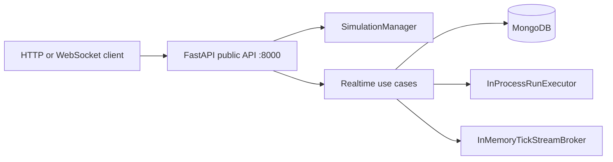

# Traffic Engine Development Guide

## Audience

This guide is for developers running the active repository scope locally: MongoDB, the FastAPI service, the persisted realtime workflow, and the focused validation slices for core and API behavior.

## Bootstrap

```bash
cd /home/erick/Desktop/github/Engine
python3 -m venv .venv
source .venv/bin/activate
python -m pip install --upgrade pip
python -m pip install -e ".[dev]"
```

See [MONGODB_LOCAL.md](./MONGODB_LOCAL.md) for environment variables, collections, and indexes.

## Local Services

| Service | Command | Default URL |
| --- | --- | --- |
| MongoDB | `cp .env.example .env && docker compose up -d mongodb` | `mongodb://...` from `.env` |
| FastAPI public API | `uvicorn traffic_engine.api.app:app --reload` | `http://localhost:8000` |
| OpenAPI docs | `started by FastAPI` | `http://localhost:8000/docs` |

## Local Runtime Topology



## End-To-End Local Workflow

### 1. Verify service health and realtime availability

```bash
curl http://localhost:8000/health
curl http://localhost:8000/realtime/status
```

Expect `status: healthy` and `available: true` before testing create, replay, or extension.

### 2. Create a persisted realtime session

```bash
curl -X POST http://localhost:8000/realtime/sessions \
  -H 'Content-Type: application/json' \
  -d '{
    "area": "Roma Norte, Ciudad de Mexico",
    "runtime": {"mode": "realtime", "tick_interval_ms": 100, "max_ticks": 20}
  }'
```

Capture the returned `session_id`, `run_id`, and `websocket_url`.

### 3. Inspect persisted sessions, runs, and ticks

```bash
curl http://localhost:8000/realtime/sessions
curl http://localhost:8000/realtime/sessions/$SESSION_ID/runs
curl "http://localhost:8000/realtime/sessions/$SESSION_ID/ticks?run_id=$RUN_ID&from_tick=-1&limit=5"
```

Use [CONSUME_SERVICE.md](./CONSUME_SERVICE.md) for Python examples that open the canonical WebSocket and iterate replay-plus-follow events.

### 4. Extend a finished session with a new run

```bash
curl -X POST http://localhost:8000/realtime/sessions/$SESSION_ID/runs \
  -H 'Content-Type: application/json' \
  -d '{"n_steps": 20}'
```

The extension creates a new `run_id` under the same `session_id`. It does not recreate the session document.

## Focused Validation

| Goal | Command |
| --- | --- |
| Realtime API, WebSocket, execution, and persistence slice | `.venv/bin/python -m pytest tests/test_realtime_api_contracts.py tests/test_realtime_websocket_contracts.py tests/test_realtime_run_execution.py tests/test_realtime_repository_contracts.py -q` |
| Realtime compatibility and lane-aware payload slice | `.venv/bin/python -m pytest tests/test_realtime_sse_recovery.py tests/test_realtime_lane_payload_contracts.py tests/test_snapshot_lane_payloads.py -q` |
| Core simulation and multilane domain slice | `.venv/bin/python -m pytest tests/test_domain_models.py tests/test_nasch_simulation.py tests/test_multilane_cellular_grid.py tests/test_multilane_topology_converter.py tests/test_lane_change_policy.py tests/test_public_transport_behavior.py -q` |
| API boundary smoke slice | `.venv/bin/python -m pytest tests/test_api_layer.py tests/test_real_engine_smoke.py -q` |

## Troubleshooting

| Symptom | Likely cause | Check |
| --- | --- | --- |
| `/realtime/status` returns `available: false` | MongoDB or environment is not configured | Re-read `.env` and [MONGODB_LOCAL.md](./MONGODB_LOCAL.md) |
| `POST /realtime/sessions` returns 503 | The realtime service container could not compose persistence dependencies | Confirm MongoDB is running and `.env` points to the expected database |
| No sessions are returned from `/realtime/sessions` | The API is not writing to MongoDB yet or you are filtering too aggressively | Retry without a `status` filter and confirm session creation is succeeding |
| WebSocket follow closes immediately | The selected run already reached a terminal state | Inspect `/realtime/sessions/$SESSION_ID/runs` and choose an active run or start a new session |
| Tick replay appears truncated | Pagination window is too small for the run you are inspecting | Repeat `/ticks` with the last received `tick_number` as `from_tick` |
