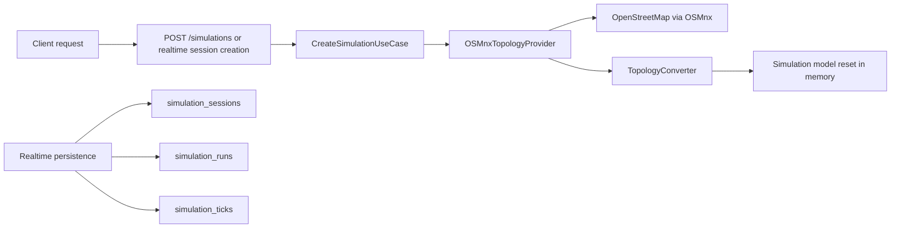
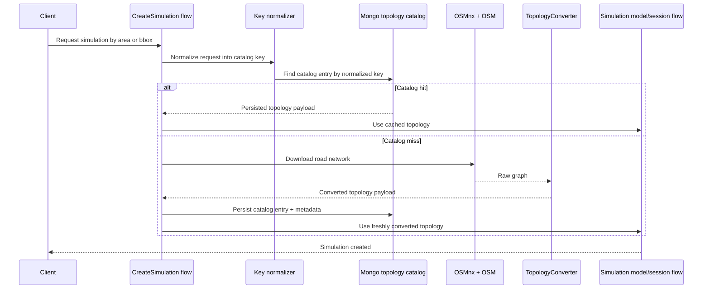
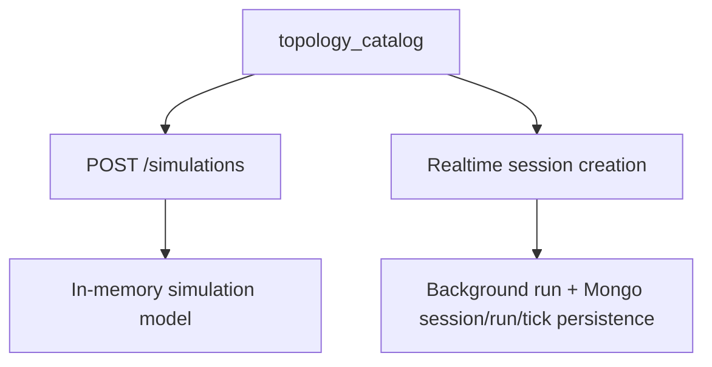

# Geographic Topology Catalog

## Purpose

Define the planned MongoDB-backed catalog for reusable geographic/topology payloads so simulation requests do not always download road data from OpenStreetMap at request time.

## Audience

| Audience | Use This Doc For |
| --- | --- |
| Maintainers | Align a future MongoDB catalog design with the current topology loading path |
| Onboarding developers | Understand what is implemented today versus the intended cache/catalog behavior |

## Current State

| Area | Current Behavior | Source Boundary |
| --- | --- | --- |
| Synchronous `/simulations` flow | Loads topology directly through `OSMnxTopologyProvider` and initializes the simulation model in memory | `SimulationManager` -> `CreateSimulationUseCase` -> `TopologyProvider` |
| Realtime MongoDB persistence | Stores session metadata, execution runs, and tick history only | `simulation_sessions`, `simulation_runs`, `simulation_ticks` |
| Geographic/topology catalog | Not implemented | No MongoDB collection or repository currently owns reusable topology payloads |

## What Exists Today

The current service can download missing geographic data on demand, but it does not persist the converted topology in MongoDB for reuse across later requests.

## Target Catalog Behavior

The target behavior is a read-through catalog shared by synchronous and realtime simulation creation.

### Target Read-Through Steps

| Step | Behavior |
| --- | --- |
| 1 | Accept a simulation request with exactly one locator: named `area` or geographic `bbox` |
| 2 | Normalize that locator into a stable catalog key |
| 3 | Query MongoDB for an existing catalog document by the normalized key |
| 4 | If found and usable, deserialize the topology payload and continue initialization |
| 5 | If missing, stale, or explicitly invalidated, download the road network through OSMnx |
| 6 | Convert the downloaded graph into the engine `TopologyData`-compatible payload |
| 7 | Persist the catalog entry with status, metadata, topology payload, and freshness fields |
| 8 | Use the resulting topology for either synchronous `/simulations` flows or realtime session creation |
| 9 | Reuse the same MongoDB catalog entry for future requests with the same normalized locator |

## Catalog Key Strategy

The catalog key should represent the requested geography, not a single simulation run.

| Request Type | Normalization Goal | Example Stored Fields |
| --- | --- | --- |
| Named area | Stable text key after trimming, lowercasing, and consistent locale formatting | `lookup.type=area`, `lookup.area.raw`, `lookup.area.normalized` |
| Bounding box | Stable spatial key after coordinate validation and deterministic rounding/ordering | `lookup.type=bbox`, `lookup.bbox.min_x`, `lookup.bbox.max_x`, `lookup.bbox.min_y`, `lookup.bbox.max_y`, `lookup.bbox.precision_dp` |

### Proposed Unique Identity

| Field | Role |
| --- | --- |
| `catalog_key` | Primary reusable identifier for the normalized request shape |
| `lookup.type` | Distinguishes area-based and bbox-based requests |
| `lookup.hash` | Optional compact digest of the normalized lookup payload for easier tracing |

The exact normalization algorithm is not implemented yet. The main requirement is that equivalent requests map to the same `catalog_key` and non-equivalent requests do not collide.

## Proposed Collection

Use a separate collection such as `topology_catalog`.

### Document Shape

| Field | Type | Required | Purpose |
| --- | --- | --- | --- |
| `_id` | string | Yes | Same value as `catalog_key` for direct lookup |
| `catalog_key` | string | Yes | Stable normalized identifier |
| `status` | string | Yes | Lifecycle state such as `ready`, `fetching`, `failed`, `stale`, `invalidated` |
| `lookup` | object | Yes | Canonical request descriptor for area or bbox |
| `source` | object | Yes | Provenance for the downloaded geography |
| `topology` | object | No when failed | Converted topology payload reusable by the engine |
| `topology_summary` | object | No when failed | Cheap summary for diagnostics without loading the full payload |
| `freshness` | object | Yes | Versioning and refresh policy metadata |
| `failure` | object | No | Structured failure state for misses that could not be resolved |
| `created_at` | datetime | Yes | First time this catalog key was recorded |
| `updated_at` | datetime | Yes | Last document mutation time |
| `last_accessed_at` | datetime | No | Optional read-tracking for operations and pruning |
| `lock` | object | No | Optional in-document fetch coordination metadata |

### Lookup Object

| Field | Type | Purpose |
| --- | --- | --- |
| `lookup.type` | string | `area` or `bbox` |
| `lookup.area.raw` | string | Original user-provided area string |
| `lookup.area.normalized` | string | Canonical area key |
| `lookup.bbox.min_x` | float | Canonical west longitude |
| `lookup.bbox.max_x` | float | Canonical east longitude |
| `lookup.bbox.min_y` | float | Canonical south latitude |
| `lookup.bbox.max_y` | float | Canonical north latitude |
| `lookup.bbox.precision_dp` | integer | Rounding precision used to derive the key |
| `lookup.hash` | string | Optional digest over the normalized lookup |

### Source Metadata

| Field | Type | Purpose |
| --- | --- | --- |
| `source.provider` | string | Expected initial value: `osmnx` |
| `source.network_type` | string | For example `drive` |
| `source.simplify` | boolean | Captures request-time graph simplification setting |
| `source.retain_all` | boolean | Captures request-time OSMnx graph setting |
| `source.downloaded_at` | datetime | When the upstream fetch completed |
| `source.osm_extract_reference` | string | Optional upstream region or extract identifier if introduced later |
| `source.request_fingerprint` | object | Normalized upstream request fields for auditing |

### Topology Payload Shape

The payload should store converted engine-ready topology, not raw NetworkX objects.

| Field | Type | Purpose |
| --- | --- | --- |
| `topology.nodes` | object/map | Node id to node payload |
| `topology.nodes.<id>.x` | float | Longitude or projected x coordinate used by the engine |
| `topology.nodes.<id>.y` | float | Latitude or projected y coordinate used by the engine |
| `topology.nodes.<id>.is_boundary` | boolean | Boundary marker used for spawn/exit logic |
| `topology.edges` | object/map | Edge key to edge payload |
| `topology.edges.<key>.length_m` | float | Physical edge length |
| `topology.edges.<key>.speed_kph` | number | Converted road speed |
| `topology.edges.<key>.n_cells` | integer | Discretized cell count |
| `topology.edges.<key>.vmax_cells` | integer | Max cellular speed |
| `topology.edges.<key>.geometry_points` | array | Polyline points used for shape reconstruction |
| `topology.bbox` | object | Bounding box enclosing the converted topology |

### Topology Summary Shape

| Field | Purpose |
| --- | --- |
| `topology_summary.nodes_count` | Quick node cardinality |
| `topology_summary.edges_count` | Quick edge cardinality |
| `topology_summary.boundary_nodes` | Boundary-node count |
| `topology_summary.total_cells` | Aggregate cellular size |
| `topology_summary.bbox` | Summary bounding box |

## Indexes and Constraints

| Index | Type | Reason |
| --- | --- | --- |
| `catalog_key` | Unique | One canonical document per normalized geography |
| `status, updated_at` | Compound | Find stale, failed, or in-progress entries for operators or refresh jobs |
| `lookup.type, lookup.hash` | Compound | Support diagnostics and alternate lookup paths |
| `freshness.expires_at` | Standard | Sweep candidates for refresh or invalidation |
| `last_accessed_at` | Standard | Optional cache-pruning and usage analysis |

If bbox overlap queries become a requirement later, introduce a separate geospatial summary field rather than overloading the primary key path.

## Freshness and Versioning

Catalog entries should be reusable, but not immutable forever.

| Field | Purpose |
| --- | --- |
| `freshness.schema_version` | Version of the Mongo document shape |
| `freshness.converter_version` | Version of the topology conversion logic |
| `freshness.source_version` | Optional upstream data release identifier when available |
| `freshness.fetched_at` | Timestamp of successful upstream fetch |
| `freshness.refresh_after` | Soft freshness threshold for proactive refresh |
| `freshness.expires_at` | Hard threshold after which the entry should not be treated as ready without refresh |
| `freshness.invalidated_reason` | Optional operator or migration reason |

The main versioning rule is simple: if the topology converter or document schema changes incompatibly, existing entries should be marked stale or invalidated instead of silently reused.

## Failure Handling

| Scenario | Catalog Behavior |
| --- | --- |
| First request for a missing key | Insert or transition document into `fetching`, then attempt upstream download |
| Upstream download fails | Persist `status=failed` with structured failure payload, timestamps, and retry guidance |
| Converter fails after download | Persist failure metadata separate from transport failures |
| Concurrent requests for the same key | Rely on unique key plus status/lock metadata so only one request owns the fetch path |
| Stale entry encountered | Serve only if policy allows stale reads; otherwise refresh before simulation initialization |
| Manual invalidation | Set `status=invalidated` and preserve metadata for traceability |

### Failure Payload

| Field | Purpose |
| --- | --- |
| `failure.kind` | Category such as `not_found`, `upstream_unavailable`, `conversion_error`, `validation_error` |
| `failure.message` | Short operator-readable summary |
| `failure.first_failed_at` | When the key first failed |
| `failure.last_failed_at` | Most recent failure time |
| `failure.retry_after` | Optional backoff timestamp |
| `failure.attempt_count` | Retry counter |

## Why This Stays Separate From Realtime Collections

The topology catalog should not be mixed into `simulation_sessions`, `simulation_runs`, or `simulation_ticks`.

| Existing Collection | Why It Should Stay Separate From the Catalog |
| --- | --- |
| `simulation_sessions` | Sessions are client lifecycle records; many sessions can reference the same geography |
| `simulation_runs` | Runs capture execution attempts and runtime outcomes, not reusable geographic assets |
| `simulation_ticks` | Ticks are high-volume append-only simulation history and would bloat any reusable topology document |

### Separation Rationale

| Concern | Catalog | Realtime Collections |
| --- | --- | --- |
| Reuse scope | Shared across many simulations | Scoped to one session or run |
| Write pattern | Occasional upsert/refresh | High-frequency runtime writes |
| Retention policy | Longer-lived reference data | Operational history and replay windows |
| Document size pressure | Large but bounded topology payload | Potentially unbounded tick growth |
| Freshness semantics | Versioned cache/catalog lifecycle | Execution lifecycle and replay semantics |

## Operational Concerns

| Concern | Recommendation |
| --- | --- |
| Document size | Persist converted topology only; avoid raw graph objects and consider chunking if city-scale payloads approach MongoDB size limits |
| Duplicate fetch storms | Use unique `catalog_key` plus fetch status or lock metadata to coordinate concurrent misses |
| Observability | Track hit, miss, stale, refresh, and failure counters separately from realtime metrics |
| Backfill | Support an offline warmup path for known areas without requiring a live simulation request |
| Migrations | Version document schema and converter output so stale entries can be re-built safely |
| Local development | Keep this catalog optional until the feature exists; current local Mongo instructions remain realtime-focused |

## Relationship to Simulation Flows

Once implemented, the catalog becomes a shared input dependency for both entry paths below.

The catalog is reference data. Realtime collections remain execution data.

## Scope Note

This document describes a target requirement only. The repository does not currently implement a MongoDB geographic/topology catalog.
