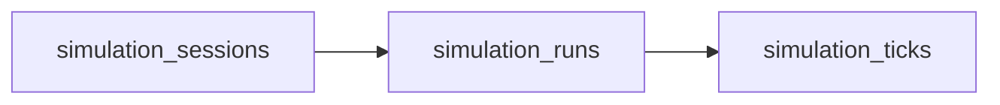

# Local MongoDB Setup

MongoDB is the durable store behind the persisted realtime workflow. Session metadata, run history, and per-tick replay state live here so clients can browse history, replay completed runs, and attach to live execution without depending on process memory.

## Startup

```bash
cp .env.example .env
docker compose up -d mongodb
```

Shutdown commands:

```bash
docker compose down
docker compose down -v
```

## Required Environment

| Variable | Purpose |
| --- | --- |
| `MONGODB_URI` | Full MongoDB client URI used by the Python persistence layer |
| `MONGODB_DATABASE` | Selected application database |
| `MONGODB_APP_NAME` | Optional client app name for diagnostics |
| `MONGO_ROOT_USER`, `MONGO_ROOT_PASSWORD` | Local container bootstrap credentials |
| `MONGO_APP_DATABASE`, `MONGO_APP_USER`, `MONGO_APP_PASSWORD` | Least-privilege application database and user |
| `MONGO_PORT` | Optional exposed host port; defaults to `27017` |

## Collection Topology



| Collection | Stores | Notes |
| --- | --- | --- |
| `simulation_sessions` | One document per public realtime session | Tracks `latest_run_id`, `latest_tick`, and `latest_metrics` for dashboards and reconnects |
| `simulation_runs` | One document per execution attempt | Extension creates a new run under the same session |
| `simulation_ticks` | One document per persisted tick | Immutable replay history; written before live publication |

## Lifecycle Mapping

MongoDB stores internal lifecycle values. Public HTTP responses and canonical WebSocket status events normalize them before exposing them to clients.

| Public contract | Session values stored in MongoDB | Run values stored in MongoDB |
| --- | --- | --- |
| `pending` | `pending` | `queued` |
| `running` | `running`, `paused` | `running` |
| `finished` | `completed` | `completed` |
| `failed` | `failed` | `failed` |
| `cancelled` | `cancelled` | `cancelled` |

## Indexes

| Collection | Fields | Type | Reason |
| --- | --- | --- | --- |
| `simulation_sessions` | `session_id` | Unique | Public session lookup |
| `simulation_sessions` | `status, updated_at` | Compound | Dashboard filtering by public lifecycle state and recent updates |
| `simulation_sessions` | `created_at` | Standard | Recent-session debugging and administration |
| `simulation_runs` | `run_id` | Unique | Direct run lookup |
| `simulation_runs` | `session_id, created_at` | Compound | Session run history in reverse chronological order |
| `simulation_runs` | `session_id, status, created_at` | Compound | Prevent multiple active runs per session and list status-filtered history |
| `simulation_runs` | `status, created_at` | Compound | Operator scans for queued or running executions |
| `simulation_ticks` | `run_id, tick_number` | Unique compound | Idempotent per-run tick persistence |
| `simulation_ticks` | `session_id, recorded_at` | Compound | Time-ordered recovery for one session |
| `simulation_ticks` | `session_id, run_id, tick_number` | Compound | Ordered replay by session, run, and cursor |

## Runtime Notes

| Topic | Current behavior |
| --- | --- |
| Tick durability | Each tick is appended to `simulation_ticks` before it is published to live consumers |
| Replay source of truth | `GET /realtime/sessions/{session_id}/ticks` and `WS /realtime/sessions/{session_id}/ws` both replay from MongoDB first |
| Session extension | `POST /realtime/sessions/{session_id}/runs` creates a new run document; earlier runs and ticks remain immutable |
| Local executor | The default local adapter is `InProcessRunExecutor`; MongoDB owns persistence, not scheduling |
| Collection type | `simulation_ticks` is a regular collection, not a time-series collection, because the access pattern is keyed replay by `session_id`, `run_id`, and `tick_number` |

## Current Wiring

| Component | Behavior |
| --- | --- |
| `MongoSimulationSessionRepository` | Persists session metadata and latest tick summary |
| `MongoSimulationRunRepository` | Persists run lifecycle changes and run history |
| `MongoSimulationTickRepository` | Persists immutable tick history and serves replay queries |
| `realtime_router.py` | Lazily composes Mongo repositories, the in-process executor, WebSocket replay, and SSE compatibility replay |
| `api.app` shutdown | Closes the cached MongoDB client |

MongoDB currently covers realtime persistence only. The planned geographic topology cache remains a separate concern and is documented in `docs/GEOGRAPHIC_CATALOG.md`.
