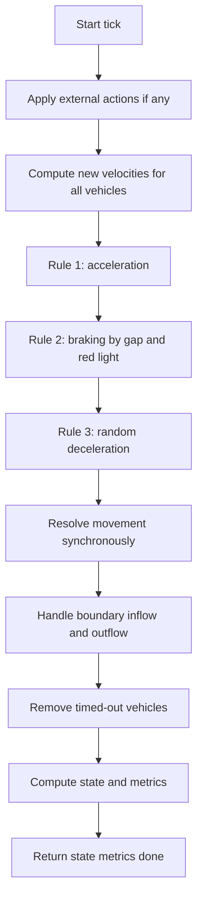
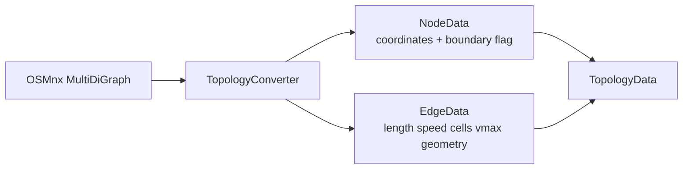

# Traffic Engine Simulation Model

## Purpose

The simulation layer implements a single-lane-per-edge Nagel-Schreckenberg cellular automaton over a road network converted from geographic graph data.

## Core Model

| Concept | Current Type | Role |
| --- | --- | --- |
| Road network | `TopologyData` | Domain-ready nodes, edges, and bounding box |
| Vehicle entity | `Vehicle` | Internal mutable simulation object with route, velocity, and wait state |
| Vehicle snapshot | `VehicleState` | API-facing vehicle view with geographic coordinates and speed |
| Traffic light entity | `TrafficLight` | NS/EW phase controller attached to an intersection |
| Traffic light snapshot | `LightState` | API-facing signal state with phase and timing |
| Simulation state | `SimulationState` | Compact current state for orchestration |
| Metrics | `Metrics` | Aggregate KPIs for monitoring and analysis |
| Detailed observation | `SnapshotData` | Visualization-oriented snapshot including edge density and flow |

## NaSch Tick Lifecycle

## NaSch Rules in This Repo

| Rule | Function | Effect |
| --- | --- | --- |
| Acceleration | `nasch_rule_1_acceleration` | Increase velocity up to effective `vmax` |
| Braking | `nasch_rule_2_braking` | Limit velocity to available free cells |
| Randomization | `nasch_rule_3_randomization` | Reduce velocity by one with probability `noise_prob` |
| Movement | `nasch_rule_4_movement` | Advance position by final velocity |

## Physical Defaults

| Parameter | Value | Meaning |
| --- | --- | --- |
| `CELL_SIZE_M` | `5.0` | Length of one discrete road cell |
| `TICK_SECONDS` | `1.0` | Duration of one simulation tick |
| `V_MAX_CELLS` | `5` | Global upper bound for cellular velocity |
| `NOISE_PROB` | `0.28` | Base stochastic braking probability |
| `TIMEOUT_TICKS` | `50` | Stationary timeout before removal |
| `ENTRY_PROB` | `0.55` | Boundary-origin bias |
| `EXIT_PROB` | `0.70` | Boundary-destination bias |

## Vehicle Types

| Type | Speed Factor | Noise Factor | Size Cells |
| --- | --- | --- | --- |
| `car` | `1.0` | `1.0` | `1` |
| `bus` | `0.55` | `0.6` | `2` |
| `moto` | `1.25` | `1.5` | `1` |

## Topology Conversion

## Signals

| Aspect | Current Behavior |
| --- | --- |
| Controller | `TrafficLight` with `cycle_ticks`, `green_ratio`, `offset_ticks` |
| Phases | `NS_GREEN` and `EW_GREEN` |
| Edge assignment | Incoming edges classified by geographic bearing |
| Default placement in manager path | Fixed provider |
| Alternative placement | Betweenness-centrality provider |

## Boundary and Lifecycle Behavior

| Behavior | Summary |
| --- | --- |
| Boundary detection | Nodes near the bounding box edge, plus explicitly marked boundary nodes |
| Initial spawn | Controlled by simulation config on `reset()` |
| Ongoing flow | Boundary inflow/outflow is handled after each synchronous step |
| Completion | `step()` returns a `done` flag when model termination criteria are met |
| Timeout removal | Vehicles stopped for too many ticks are removed |

## Maintainer Map

| Concern | Location |
| --- | --- |
| Domain data structures | `src/traffic_engine/domain/models/` |
| Cellular grid mechanics | `src/traffic_engine/domain/simulation/cellular_grid.py` |
| Simulation interface | `src/traffic_engine/domain/simulation/interfaces.py` |
| NaSch implementation | `src/traffic_engine/domain/simulation/nasch_model.py` |
| Pure rule functions | `src/traffic_engine/domain/simulation/nasch_rules.py` |
